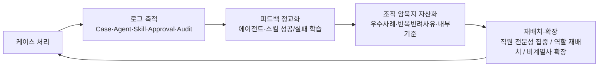

---
tags:
  - area/product
  - type/vision
  - status/active
date: 2026-07-04
up: "[[INDEX|제품 인덱스]]"
aliases:
  - 나선형 성장
  - spiral growth
  - 성장 나선
  - AX 로드맵
---
# 나선형 성장 구조 (Spiral Growth) — 발표 핵심 킥

> **위치**: 대회 스킬(DDBM-Harness-SDD) 계약에는 없지만 **우리 제품의 장기 비전이자 발표 핵심 킥**으로 필요해 신설(2026-07-04 전략회의 확정, [[2026-07-04-전략회의-정리본]]). [[차별성-경험레이어-서사]]가 "왜", [[차별성-설정근거상향-흐름]]이 "어떻게(케이스 단위)"라면, 이 문서는 **"시간이 지날수록 왜 더 강해지는가"**의 척추다.
> ⚠️ **성격**: 이것은 **운영 가설(hypothesis)**이다 — 성과 수치로 단정하지 않고 "설계 방향·기대 구조"로 제시한다.

---

## 1. 한 문장

케이스를 처리할수록 **로그가 쌓이고 → 에이전트·스킬이 피드백으로 정교해지고 → 조직의 암묵지(노하우)가 AI가 학습·재사용할 수 있는 자산으로 축적**된다. 그래서 이 시스템은 쓸수록 **직원·조직·그룹이 함께 성장하는 나선(spiral)**을 그린다.

## 2. 성장 루프 (한 바퀴)

- **로그가 연료**: [[rules/agent-rules|Capture-by-default]]로 남는 모든 판단·근거·승인·감사 로그가 다음 바퀴의 학습 재료가 된다. (로그=신뢰장치이자 성장연료 이중 역할)
- **정교화**: 에이전트·스킬이 어디서 잘 먹히고 어디서 실패하는지(Agent/Skill Memory 개념, [[08_본선/03_제품/01_결정-준비/casesops-분기/01-메모리-거버넌스|메모리 거버넌스]] `[분기/미확정]`)가 축적되어 개선된다.
- **암묵지 자산화**: 개인 머릿속 노하우 → 조직이 재사용 가능한 운영자산으로 전환. (원본 PII는 비반출, 비식별·집계 형태로만 — [[data-strategy]])

## 3. 4관점 성장 (경험레이어 서사와 접합)

| 관점 | 나선이 도는 만큼 |
|---|---|
| **직원** | 반복 정리에서 해방 → **자기 전문성이 필요한 판단에 더 집중**. 시간이 갈수록 고난도 판단 역량이 축적됨 |
| **조직** | 케이스·숙련도 데이터로 **역할을 더 정교하게 재배치**. 병목·반복반려가 드러나 프로세스가 개선됨 |
| **그룹** | 케이스 처리 표준이 검증될수록 **비계열사·타 도메인으로 확장** 가능한 인프라가 됨 |
| **고객** | 상담·심사·보호·대응이 **누적적으로 빨라지고 일관돼짐**(내부 AX가 외부 CX로) |

## 4. 발표에서 쓰는 법

- **마무리 슬라이드**: "3년 후, JB는 AX(AI 전환)를 완전히 준비한 상태" — 나선이 여러 바퀴 돈 미래상.
- **인포그래픽**: 성장 나선 1장(회의 확정 — 제작 대상). 문서(SSOT) → 다이어그램 파생 원칙([[viz-mermaid-over-excalidraw|Mermaid 우선]]).
- **금지**: "N% 성장/개선" 등 정량 성과 단정(가설이므로). "설계상 이렇게 축적되도록 만들었다"로 표현.

## 5. 미결 (팀 — 2026-07-04 회의 논쟁)

- **나선의 방향성 논쟁** `[미결]`: 이승보=수렴/뾰족해짐(전문성 심화) vs 김주용=확산/부피 증가(범위 확장). 회의에서 **"모래시계" 절충안**까지 나옴 — 정식 형태 미확정.
- **그래프 축·마일스톤** `[미검증]`: x·y축 정식 명칭, 연도별 마일스톤 수치 = 근거 검증 필요(창작 금지).
- **근거 보강 대상**: 조직 암묵지의 학습데이터화·재사용은 [[08_본선/03_제품/01_결정-준비/casesops-분기/01-메모리-거버넌스|메모리 거버넌스]]가 구현·확정돼야 실증 가능(현재 `[분기/미확정]`).

## 연결
[[차별성-경험레이어-서사]] · [[차별성-설정근거상향-흐름]] · [[business-model]] · [[2026-07-04-전략회의-정리본]] · [[08_본선/03_제품/01_결정-준비/casesops-분기/_INDEX|CaseOps 분기]]
