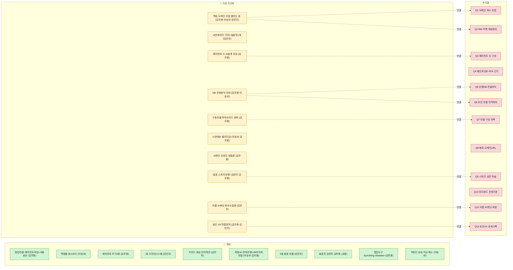

# 보드-결정현황

> 📸 이 화면을 캡처해 카톡/피그마에 붙이세요

목적: [[결정-현황-종합]]을 확정/가안/미결 3열로 한눈에 보여줘 "무엇이 정해졌고 무엇을 골라야 하나"를 즉시 파악한다.

```mermaid
flowchart LR
  subgraph OK["✅ 확정"]
    direction TB
    A1["협업컨셉: 에이전트작업+사람승인 (김주용)"]
    A2["역할별 대시보드 (이승보)"]
    A3["에이전트 무기4종 (김주용)"]
    A4["JB 디자인시스템 (김민주)"]
    A5["키보드 중심 인터랙션 (김민주)"]
    A6["계열사=전북은행+JB우리캐피탈 (이승보·김주용)"]
    A7["5분 발표 흐름 (김민주)"]
    A8["발표자 김민주·김주용 (공동)"]
    A9["협업도구 Syncthing·Obsidian (김주용)"]
    A10["직장인 상금 이슈 해소 (이승보)"]
  end

  subgraph TENT["🔶 가안·조건부"]
    direction TB
    B1["핵심 도메인 조합 좁히는 중 (김주용·이승보·김민주)"]
    B2["시연데이터: 더미+실동작1개 (김민주)"]
    B3["구동모델 하이브리드 유력 (김주용)"]
    B4["에이전트 수 AI설계 위임 (김주용)"]
    B5["DB 연동방식 미정 (김주용·이승보)"]
    B6["시연영상 퀄리티업 (이승보·김주용)"]
    B7["AI판단 신뢰도 방법론 (김주용)"]
    B8["승인 UX 마찰장치 (김주용·김민주)"]
    B9["발표 스토리 방향 (김민주·김주용)"]
    B10["이름·브랜딩 후보수집중 (김민주)"]
  end

  subgraph OPEN["❓ 미결"]
    direction TB
    Q1["Q1 도메인 개수·조합"]
    Q2["Q2 RM 직책 포괄범위"]
    Q3["Q3 에이전트 수·구성"]
    Q4["Q4 페인포인트·ROI 근거"]
    Q5["Q5 은행DB 연결방식"]
    Q6["Q6 보안 연결 아키텍처"]
    Q7["Q7 모델 구성 선택"]
    Q8["Q8 배포·도메인URL"]
    Q9["Q9 스토리·공감 전술"]
    Q10["Q10 리더보드 산정기준"]
    Q11["Q11 이름·브랜딩 최종"]
    Q12["Q12 승인UX 상세스펙"]
  end

  B1 -.연결.-> Q1
  B1 -.연결.-> Q2
  B4 -.연결.-> Q3
  B3 -.연결.-> Q7
  B5 -.연결.-> Q5
  B5 -.연결.-> Q6
  B9 -.연결.-> Q9
  B10 -.연결.-> Q11
  B8 -.연결.-> Q12

  classDef ok fill:#d1f5d3,stroke:#2e7d32,color:#1b1b1b
  classDef tent fill:#fff3cd,stroke:#b8860b,color:#1b1b1b
  classDef open fill:#f8d7da,stroke:#c62828,color:#1b1b1b
  class A1,A2,A3,A4,A5,A6,A7,A8,A9,A10 ok
  class B1,B2,B3,B4,B5,B6,B7,B8,B9,B10 tent
  class Q1,Q2,Q3,Q4,Q5,Q6,Q7,Q8,Q9,Q10,Q11,Q12 open
```
