# 보드: 인물별 오늘 할 일

> 📸 이 화면을 캡처해 카톡/피그마에 붙이세요

목적: [[결정-현황-종합]]의 미결 항목을 담당자별로 나눠, "나는 오늘 무엇을 고르고 무엇을 하면 되는지" 한눈에 보여준다.

> 신뢰마커: 🔴 = 미결(오늘 골라야 함), ⚪ = 다음 액션(결정 이후 실행). 항목 내용은 [[결정-현황-종합]] 원문 기준, 재해석 없음.

```mermaid
flowchart TB
  classDef decision fill:#fde2e1,stroke:#c0392b,color:#7b241c
  classDef action fill:#eaeded,stroke:#5d6d7e,color:#2c3e50
  classDef person fill:#2c3e50,stroke:#2c3e50,color:#ffffff

  P1[이승보 개발]:::person --> D1_1["Q3 에이전트 수·구성 확정"]:::decision
  P1 --> D1_2["Q5 DB연동 방식 선택 정적·서버·하이브리드"]:::decision
  P1 --> A1_1["Q7 로컬모델 후보 실행 Gemma 등"]:::action

  P2[김민주 시연·발표·브랜딩]:::person --> D2_1["Q11 시스템 이름·브랜딩 확정"]:::decision
  P2 --> D2_2["Q9 발표 스토리 배치 확정"]:::decision
  P2 --> A2_1["Q12 승인 UX 시안 이승보와 협의"]:::action

  P3[김주용 문서·API·시각화]:::person --> D3_1["Q1 도메인 개수·조합 확정"]:::decision
  P3 --> D3_2["Q6 보안 연결 아키텍처 방식 선택"]:::decision
  P3 --> A3_1["Q8 배포·도메인 URL 준비"]:::action
  P3 --> A3_2["Q4 ROI 근거 수치 조사"]:::action

  P4[최영욱 서포트]:::person --> A4_1["Q10 리더보드 산정기준 대회 안내문 확인"]:::action
  P4 --> A4_2["로컬모델 구동 컴퓨팅 자원 준비"]:::action
```

