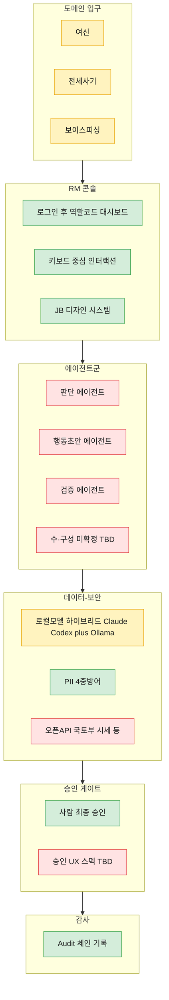

# 보드-제품한눈

> 📸 이 화면을 캡처해 카톡/피그마에 붙이세요

목적: [[결정-현황-종합]] 기준 제품 구조를 한 장으로 — 도메인→콘솔→에이전트→데이터/보안→승인게이트→감사, 확정/가안/미결을 색으로 구분.

```mermaid
flowchart TD
  classDef done fill:#d4edda,stroke:#2f9e44,color:#1a1a1a
  classDef tentative fill:#fff3bf,stroke:#e8a400,color:#1a1a1a
  classDef open fill:#ffe3e3,stroke:#e03131,color:#1a1a1a

  subgraph DOMAIN["도메인 입구"]
    D1["여신"]:::tentative
    D2["전세사기"]:::tentative
    D3["보이스피싱"]:::tentative
  end

  subgraph CONSOLE["RM 콘솔"]
    C1["로그인 후 역할코드 대시보드"]:::done
    C2["키보드 중심 인터랙션"]:::done
    C3["JB 디자인 시스템"]:::done
  end

  subgraph AGENTS["에이전트군"]
    A1["판단 에이전트"]:::open
    A2["행동초안 에이전트"]:::open
    A3["검증 에이전트"]:::open
    A4["수·구성 미확정 TBD"]:::open
  end

  subgraph DATA["데이터-보안"]
    S1["로컬모델 하이브리드 Claude Codex plus Ollama"]:::tentative
    S2["PII 4중방어"]:::done
    S3["오픈API 국토부 시세 등"]:::open
  end

  subgraph GATE["승인 게이트"]
    G1["사람 최종 승인"]:::done
    G2["승인 UX 스펙 TBD"]:::open
  end

  subgraph AUDIT["감사"]
    U1["Audit 체인 기록"]:::done
  end

  DOMAIN --> CONSOLE --> AGENTS --> DATA --> GATE --> AUDIT
```

범례: 초록=확정, 노랑=가안·조건부, 빨강=미결(TBD). 세부 근거는 [[결정-현황-종합]] 참조.
