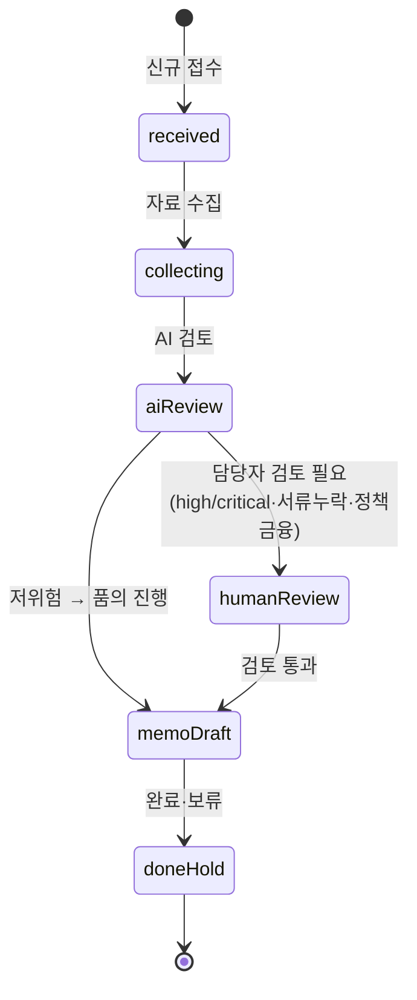
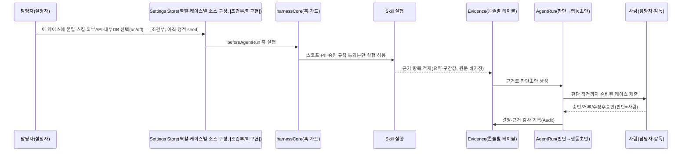

---
tags:
  - area/product
  - type/reference
  - status/active
date: 2026-07-04
up: "[[INDEX|제품 인덱스]]"
aliases: [오케스트레이터, AgentRun 파이프라인]
---

# 오케스트레이터

> **갱신 노트(2026-07-04)**: 이전 버전(07-03)은 예선 `app.js`의 단일 5컬럼 FSM + 승인 매트릭스(L0~L4)를 정본으로 삼았다. 본선 실 프로토타입(JB_project2)은 **콘솔별 독립 FSM + 오케스트레이터(콘솔 내부 `*-intake` 에이전트) + hashchange 기반 라우팅**으로 구현돼 있다. 이 문서는 **CCL(기업여신, 히어로 콘솔)을 정본 예시로** 재작성하고, 나머지 3콘솔·상위 라우팅 계층을 그 위에 정합한다.
>
> 근거: `_vendor/JB_project2/app/cclConsole.core.js`·`cclConsole.app.js`(hash 라우팅)·`harnessCore.js`(훅 실행기)·`harnessRegistry.js`(manifest), [[08_본선/03_제품/docs/05_domain-model|05_domain-model]] §3·§5, [[08_본선/03_제품/00_vision/차별성-설정근거상향-흐름|차별성-설정근거상향-흐름]](담당자 설정→근거상향 시퀀스).

---

## 1. 두 계층의 오케스트레이션 — 콘솔 선택 라우팅 + 콘솔 내부 FSM

**상위 계층(콘솔 라우팅)**: 사용자가 계열사(전북은행/JB우리캐피탈) → 역할(여신심사/FDS/전세보호/캐피탈 다도메인)을 선택하면 `window.location.hash`가 콘솔 전용 프리픽스로 바뀌고, 전역 `hashchange` 리스너(`app.js:5757`)가 `cclRouteFromHash`/`fdrRouteFromHash`/`jpoRouteFromHash`/`jbwcRouteFromHash` 중 매칭되는 라우터에 렌더링을 위임한다. 각 콘솔은 자기 라우터·자기 렌더 함수(`cclConsole.app.js` 등)를 가진 **독립 SPA 조각**이며, 공용 "메인 오케스트레이터"가 콘솔 내부 케이스를 직접 만지지 않는다 — 공용 계층이 하는 일은 **라우팅 진입점 결정 + `harnessRegistry`를 통한 manifest 조회**뿐이다.

**하위 계층(콘솔 내부 FSM)**: 콘솔에 진입하면 그 콘솔의 `*-intake` 에이전트(예: `ccl-intake`)가 paperclip의 Wakeup Coordinator + Run Executor 역할을 콘솔 스코프 안에서 수행한다 — Case를 적절한 전문 에이전트로 라우팅하고, 상태 전이·승인 등록·핸드오프 생성을 조율한다.

**공통 금지**(콘솔 공통): 고객 대상 행동을 직접 실행하지 않는다, 승인·계좌상태 변경을 하지 않는다, 근거 누락을 숨기지 않는다, high/critical 케이스를 자동 종결하지 않는다(`harnessGuardCheckAutoClose`).

---

## 2. Case FSM — CCL(히어로 콘솔) 6단

`cclConsole.core.js`의 `CCL_BOARD_COLUMNS`를 그대로 FSM 정의로 채택한다([[08_본선/03_제품/docs/05_domain-model|05_domain-model]] §3.1과 동일).



| 상태 | 의미 | 전이 조건 | 담당 |
|---|---|---|---|
| `received` | 케이스 접수(신규 여신 검토) | `ccl-intake` 분류 완료 | 담당자 |
| `collecting` | 자료 수집 중 | 재무·서류 자료 요청 발송 | `ccl-financial`/`ccl-doc` |
| `aiReview` | AI 검토 진행(요약·체크·초안) | 활성 에이전트 실행 중 | 배정된 콘솔 에이전트 |
| `humanReview` | 담당자 검토 필요 | high/critical·서류누락·정책금융 시 강제 `requiresHumanReview=true` | 담당자 |
| `memoDraft` | 품의 진행 | 검토 통과 또는 저위험 즉시 진행 | `ccl-memo` |
| `doneHold` | 완료·보류(비활성) | 승인/반려 확정 | 감독 |

**활성 상태**(`CCL_ACTIVE_STATUSES`): `received·collecting·aiReview·humanReview·memoDraft` — `doneHold`만 비활성. 은행 실무 `상담→심사→승인→약정·실행→사후관리`의 **심사~품의 구간**에 대응하며, 약정·기표·회수·EOD는 콘솔 범위 밖([TBD]).

**나머지 3콘솔의 FSM**은 각 콘솔 코드(`fdrConsole.core.js`·`jeonseProtectionAgents.registry.js`의 status 값·`jbWooriCapitalAgents.registry.js`)에 개별 정의돼 있으며, 공통 골격(접수→검토→승인 대기→완료, high/critical 자동종결 금지)은 동일하나 컬럼 라벨은 콘솔마다 다르다 — 상세 이관은 [TBD].

---

## 3. AgentRun 파이프라인 (판단 → 행동초안 → 검증) + 담당자 설정 → 근거상향

콘솔에 진입한 케이스는 3단 파이프라인을 돈다. **[[08_본선/03_제품/00_vision/차별성-설정근거상향-흐름|차별성-설정근거상향-흐름]]**이 이 파이프라인 앞에 신설을 요구하는 **"설정(Configuration)" 단계**를 포함해 정식화하면 아래와 같다.



| 단계 | 함수/책임(CCL 기준) | 산출물 | 담당 |
|---|---|---|---|
| **0. 설정**(신설, [조건부/미구현]) | 담당자가 케이스 유형별 스킬·커넥터를 켬 — 현재는 정적 seed, 런타임 토글 UI 미착수([[08_본선/03_제품/01_결정-준비/설계/paperclip-통합-블루프린트|블루프린트]] §6 Task 1~3) | 근거 소스 구성 | 담당자 |
| **1. 판단(Judgment)** | `ccl-financial`/`ccl-repayment` — 재무 요약·상환부담 구간 산출 | riskLevel, 확인 필요 표시 | 도메인 에이전트 |
| **2. 행동초안(Draft)** | `ccl-doc`/`ccl-policy`/`ccl-memo`/`ccl-reply` — 체크리스트·정책후보·품의초안·회신초안 | RecommendationDraft(체크리스트+초안) | 초안 에이전트 |
| **3. 검증(Verification)** | `beforeCustomerMessage`/`beforeCaseCreate` 훅 + `ccl-supervisor` 검토 등록 | 검증 통과/차단, PII·단정표현 스캔 결과 | 훅 + 감독 |

이 3단은 `agent-loop` SKILL.md의 Judgment/Verification Boundary와 대응한다 — "검증 없는 생성은 미완성".

### 3.1 승인 게이트 → 실행 → 감사

```
판단(재무/상환 요약) → 행동초안(체크리스트/품의/회신) → 검증(훅 파이프라인)
  → 승인 게이트 [requiresHumanReview=true 시 감독 결재, 잠정 L레벨 매핑은 agent-roster §3]
    ├─ 승인(approved) → 행동 실행 → doneHold
    ├─ 반려(rejected)  → 재작업 루프(0~1단으로 복귀)
    └─ 미승인·근거 부족 → humanReview 유지(자동 실행 금지)
  → *_audit_logs append-only 기록(모든 분기 공통)
```

훅 파이프라인(코드 강제, 콘솔 공통 골격) [E4]: `onRoleEnter → beforeCaseCreate → afterCaseCreate → beforeAgentRun → afterAgentRun → beforeCustomerMessage → afterApprovalDecision → onAuditWrite`. 고위험(critical) 케이스는 `harnessGuardCheckAutoClose`가 자동완료 자체를 차단한다.

### 3.2 히어로 케이스(CCL-0001) 트레이스 예시

1. `ccl-intake`가 신규 여신 검토 접수 감지 → `CASE_CREATED`(전주 카페 운전자금, CCL-0001, `BIZ-REF-0001`)
2. `ccl-financial`/`ccl-repayment`가 재무 요약·상환부담 구간 산출 → riskScore 88(예선 스냅샷 기준, 재현식은 [[08_본선/03_제품/docs/08_feature-spec|08_feature-spec]] F-1.1.1) → `requiresHumanReview=true`
3. `ccl-policy`가 정책자금 후보 정리(행동초안 단계)
4. `beforeCustomerMessage` 훅이 PII·단정표현 검토(검증 단계) → 통과
5. `humanReview` 상태에서 감독(`USR-*`) 결재 → `CCL_APPROVAL_DECIDED`
6. `ccl-reply` 초안 발송(승인 후) → `memoDraft`/`doneHold` → 감사 기록

> 라이브 LLM 연결(초안 문장 생성)은 [목표/7-4] — 7/3 기준 미연결, 미연결 시 결정형 골든패스로 폴백한다([[08_본선/03_제품/docs/08_feature-spec|08_feature-spec]] F-2.1.1).

---

## 4. 실패정책

| 실패 유형 | 정책 | 근거 |
|---|---|---|
| AgentRun 실행 오류 | 자동종결 대신 `needsReview`로 안전 강등 + 감사 기록 | `harnessGuardCheckAutoClose`, [[08_본선/03_제품/docs/08_feature-spec|08_feature-spec]] F-2.2.2 |
| 고위험(critical) 오탐 가능성 | high/critical Case는 **자동종결 금지** — 안전 강등만 허용, 위반 시도는 훅 위반 로그(`harnessStore.hookLog`)에 기록 | `harnessCore.js` 공통 가드 |
| PII 반출 스캔 실패 | 즉시 중단·회수, 원본 재사용 금지 | 신용정보법 §40조의2 ⑥⑦ |
| 스코프 위반(계열사/역할 경계 침범) | hard fail — `role scope is required` 예외, 승인 불가 즉시 차단 | `cclTable()`/`jpoTable()`/`jbwcTable()` 공통 가드 |
| 검증 반려(전세보호 `jpo-evaluator` 특유) | 검증 실패는 담당자 검토 큐(Human Inbox)로 회부, 생성 에이전트가 자체 수정하지 않는다 | `jpo-evaluator` guardrails |

**원칙**: "차단 가능 지점(생성·발송·반출)은 차단 + 감사기록, 이미 발생한 지점은 안전 강등 + reviewRequired 감사기록" — 실패를 숨기는 대신 항상 append-only 로그로 귀결시킨다. 04_tech 원안의 GENESIS 해시체인과 JB_project2의 append-only + `reviewRequired` 플래그 사이의 통합 여부는 [Open Question]([[08_본선/03_제품/docs/05_domain-model|05_domain-model]] §7).

---

## 참조

- [[08_본선/03_제품/02_agent-design/agent-roster|에이전트 로스터]]
- [[08_본선/03_제품/02_agent-design/skill-spec|스킬 명세]]
- [[08_본선/03_제품/docs/05_domain-model|도메인 모델]]
- [[08_본선/03_제품/docs/07_architecture|아키텍처]](Data flow §3, Human approval §10)
- [[08_본선/03_제품/00_vision/차별성-설정근거상향-흐름|차별성-설정근거상향-흐름]]
- [[08_본선/03_제품/01_결정-준비/설계/paperclip-통합-블루프린트|paperclip-통합-블루프린트]]
