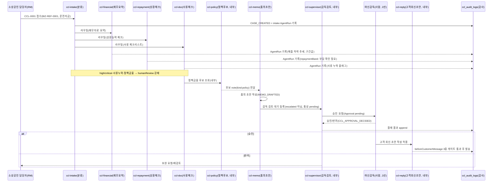

---
tags:
  - area/product
  - type/diagram
  - status/active
date: 2026-07-04
up: "[[INDEX|제품 인덱스]]"
---

# 에이전트 흐름 다이어그램 — 기업여신 콘솔(CCL) 히어로 CCL-0001

> **정합 기준**: [[08_본선/03_제품/docs/05_domain-model|05_domain-model]] §1·§5(루트 정본). 코드 SSOT: `_vendor/JB_project2/app/cclConsole.core.js`(e57b826). 히어로 = **CCL-0001**(전주 카페 운영자 운전자금, `BIZ-REF-0001`).

---

## 목적

위험 신호 입력부터 승인 게이트·감사 기록까지, **실제 CCL 8종 에이전트**의 실행 시퀀스를 시각화한다. 다른 3콘솔(FDS·전세보호·JB우리캐피탈)은 도메인별 에이전트만 다르고 오케스트레이션·승인 게이트 구조는 동일하다 [E3, 07_architecture §12].

---

## CCL 에이전트 로스터 8종 (표면 5 + 내부 3)

| id | 표시명 | 성격 | 허용 |
|---|---|---|---|
| `ccl-intake` | 여신 접수 분류 에이전트 | 표면 | 분류·라우팅·감사기록 |
| `ccl-financial` | 재무자료 요약 에이전트 | 표면 | 요약·확인필요 표시 |
| `ccl-repayment` | 상환능력 체크 에이전트 | 표면 | 부담 지표 구간 표시 |
| `ccl-doc` | 서류 체크리스트 에이전트 | 표면 | 체크리스트·보완 초안 |
| `ccl-memo` | 승인 품의 초안 에이전트 | 표면 | 초안·승인 요청 등록 |
| `ccl-policy` | 정책금융 후보 에이전트 | 내부 | 후보 나열 |
| `ccl-reply` | 고객 회신 초안 에이전트 | 내부 | 초안 작성(발송 금지) |
| `ccl-supervisor` | 여신 감독 검토 에이전트 | 내부 | 검토 대기 등록 |

모든 에이전트는 공통 금지(`CCL_COMMON_BLOCKED_ACTIONS`)로 대출 승인/거절 확정·금리/한도 산정·신용등급 확정·식별정보 원문 저장/출력·고객 자동발송을 할 수 없다 [E4].

---

## 시퀀스 다이어그램 — CCL-0001 골든패스

**훅 파이프라인**(모든 단계에 적용) [E4]: `onRoleEnter → beforeCaseCreate → afterCaseCreate → beforeAgentRun → afterAgentRun → beforeCustomerMessage → afterApprovalDecision → onAuditWrite`.

---

## 참조

- [[08_본선/03_제품/docs/05_domain-model|05_domain-model — 도메인 모델(정합 대상)]]
- [[08_본선/03_제품/02_agent-design/agent-roster|에이전트 로스터]]
- [[08_본선/03_제품/02_agent-design/orchestrator|오케스트레이터]]
- [[08_본선/03_제품/05_diagrams/03_approval-gate|승인 게이트]]
