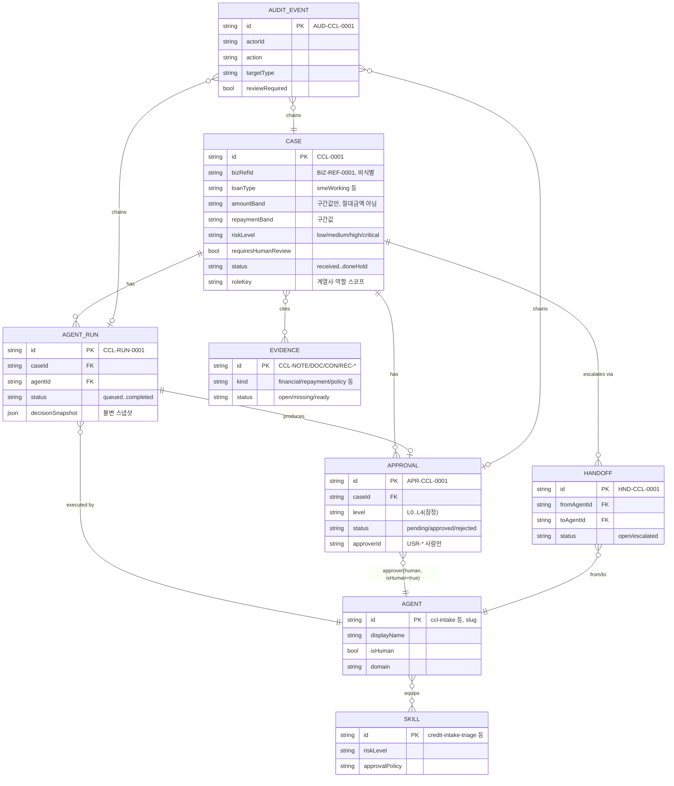

---
tags:
  - area/product
  - type/diagram
  - status/active
date: 2026-07-04
up: "[[INDEX|제품 인덱스]]"
---

# ERD — 엔티티 관계 다이어그램

> **정합 기준**: [[08_본선/03_제품/docs/05_domain-model|05_domain-model]] §2(루트 정본)·[[08_본선/03_제품/04_tech/data-model|04_tech/data-model]](필드 SSOT). 코드 SSOT: `_vendor/JB_project2/app/cclConsole.data.js`(e57b826, `cclSeedData()`). 히어로 = **CCL-0001**.

---

## 운영 계약 7단 + Handoff — JB_project2 실제 테이블 매핑

| 운영계약 단계 | JB_project2 테이블 | 핵심 식별자 |
|---|---|---|
| Case | `ccl_cases` | `CCL-000X` / `BIZ-REF-000X` |
| AgentRun | `ccl_agent_runs` | `CCL-RUN-000X` |
| Agent | `harness_agents`(← `cclConsoleAgents`) | `ccl-*` slug |
| Skill | `cclConsoleSkills` | `credit-intake-triage` 등 6종 |
| Evidence | `ccl_review_notes`·`ccl_doc_checks`·`ccl_consult_logs`·`ai_recommendations` | `CCL-NOTE/DOC/CON/REC-*` |
| Approval | `approvals` | `APR-CCL-000X` |
| Audit | `ccl_audit_logs` | `AUD-CCL-000X` |
| Handoff(멀티에이전트 층) | `agent_handoffs` | `HND-CCL-000X` |

(4콘솔 공통 패턴 — FDS는 `fdr_*`, 전세보호는 `jeonse_*`, JB우리캐피탈은 `jbwc_*`/`wooricap_*` 접두로 동일 7단 계약을 재현한다. 상세는 콘솔별 `*.data.js` 참조 [E4].)

---

## ERD 다이어그램

---

## 정합 노트 [미검증]

- 04_tech/data-model(예선 app.js 기반)은 감사를 **GENESIS 해시체인**(FNV-1a→SHA-256)으로 기술한다. JB_project2 CCL 코드는 스코프 태깅된 **append-only 로그 + `reviewRequired` 플래그**로 구현하며 해시체인은 미구현 — 통합 여부는 [Open Question][[08_본선/03_제품/docs/05_domain-model|05_domain-model §7]].
- 사람 승인자(Agent, `isHuman: true`)는 `USR-*` 식별자를 쓰고, AI 에이전트는 `ccl-*` slug를 쓴다 — 동일 `AGENT` 엔티티에 통합 [E4].

---

## 참조

- [[08_본선/03_제품/docs/05_domain-model|05_domain-model — 도메인 모델(정합 대상)]]
- [[08_본선/03_제품/04_tech/data-model|04_tech/data-model — 엔티티 필드 SSOT]]
