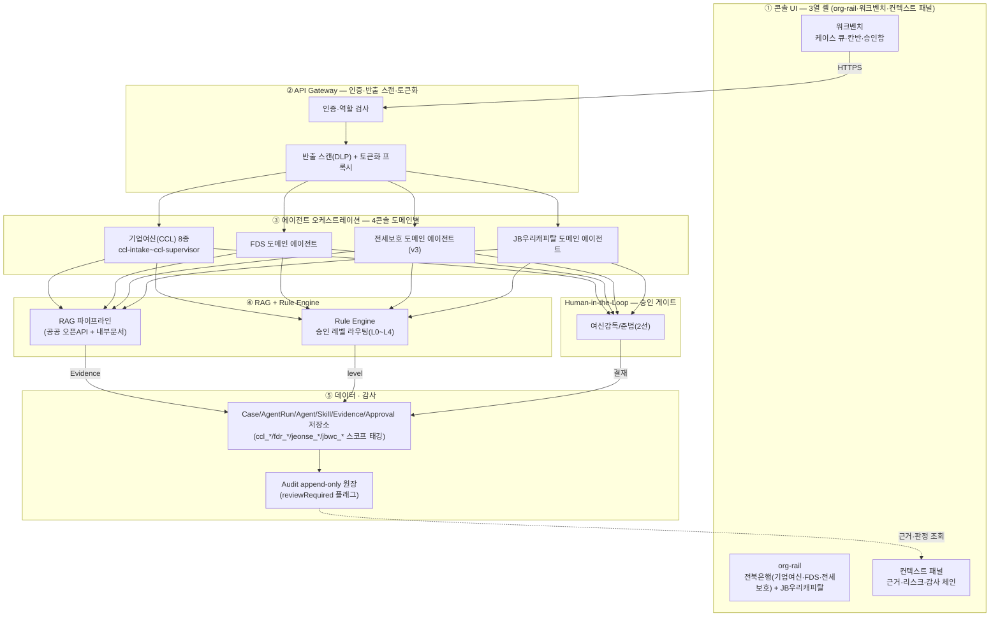

---
tags:
  - area/product
  - type/diagram
  - status/active
date: 2026-07-04
up: "[[INDEX|제품 인덱스]]"
---

# 종합 아키텍처 — 심사용 시스템 구성도

> **정합 기준**: [[08_본선/03_제품/docs/07_architecture|07_architecture]](루트 정본) 전체. 코드 SSOT: `_vendor/JB_project2/app/`(e57b826, 전세보호 하네스 v3). 히어로 = **CCL-0001**(전주 카페 운영자 운전자금). 역할축 **4콘솔**(기업여신 CCL·FDS·전세보호·JB우리캐피탈), 하이브리드 도메인(전북은행 3콘솔 + JB우리캐피탈 1콘솔).
>
> **빠른 진입**: [[본선 HOME|본선 HOME]] → 빠른 진입 섹션

---

## 목적

심사위원이 시스템 전체를 하나의 다이어그램으로 이해할 수 있는 종합 구성도. UI·오케스트레이션·RAG/규칙엔진·데이터/감사·승인 게이트 5레이어 전부 포함.

---

## 종합 다이어그램

---

## 레이어 요약

| 레이어 | 책임 | 코드 근거 |
|---|---|---|
| ① 콘솔 UI | 사람의 유일 접점, 승인 전 자동발송 UI 미노출 | `index.html` 마운트 포인트 |
| ② API Gateway | 인증·역할 + 반출 스캔·토큰화 단일 관문 | 07_architecture §2 |
| ③ 에이전트 오케스트레이션 | 4콘솔 도메인별 오케스트레이터+전문 에이전트, 승인 게이트 통과분만 고객 대상 행동 허용 | `cclConsole.core.js`·`fdrConsole.core.js`·`jeonseProtection*.js`·`jbWooriCapitalAgents.registry.js` |
| ④ RAG + Rule Engine | 근거 검색(Evidence)·신호 계산(승인 레벨 라우팅) | rag-rule-engine.md |
| ⑤ 데이터·감사 | 7단 계약 영속 + append-only 감사 로그 | 스코프 태깅(`roleKey`) |
| HITL | 여신감독/준법 결재, 자체 결재 금지 | `afterApprovalDecision` |

**예외**: FDS(피싱)만 실시간 선차단이 사람 승인 **전** 허용 — 나머지 3콘솔은 전부 승인 후 발송.

CaseOps 확장(9파이프라인·메모리라우터·119) 등은 팀 미확정 — **[분기/미확정]**, 본 다이어그램 범위 밖.

---

## 서브 다이어그램 링크

- [[08_본선/03_제품/05_diagrams/00_system-context|시스템 컨텍스트 (C4 L1)]]
- [[08_본선/03_제품/05_diagrams/01_agent-flow|에이전트 흐름]]
- [[08_본선/03_제품/05_diagrams/02_case-lifecycle|케이스 생명주기 (FSM)]]
- [[08_본선/03_제품/05_diagrams/03_approval-gate|승인 게이트]]
- [[08_본선/03_제품/05_diagrams/04_erd|ERD]]
- [[08_본선/03_제품/docs/07_architecture|07_architecture — 아키텍처(정합 대상)]]
