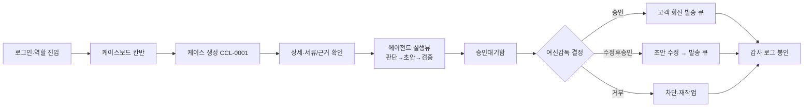

---
tags:
  - area/product
  - type/submission
  - status/active
date: 2026-07-04
up: "[[INDEX|제품 인덱스]]"
aliases: [MVP제안서, MVP Proposal]
---

# MVP 제안서 — JB LocalGuard OS

> **제출용 정본(Submission SSOT)**. 대회 제출 필수 형태(제안서) 문서로, 분산된 제품 문서를 **취합**한 것이며 창작·신규 사실을 더하지 않는다. 사실·수치·이름이 어긋나면 취합 원천 문서와 `_canon.md`가 이긴다.
> **취합 원천**: [[08_본선/03_제품/docs/02_core-bet|Core Bet]] · [[08_본선/03_제품/docs/01_business-model|Business Model(DDBM)]] · [[08_본선/03_제품/docs/18_data-strategy|Data Strategy]] · [[08_본선/03_제품/docs/06_prd|PRD]] · [[08_본선/03_제품/docs/09_flow|09 Flow]] · [[08_본선/03_제품/docs/17_business-metrics|Business Metrics]] · [[08_본선/03_제품/01_결정-준비/근거팩/ROI-근거팩|ROI 근거팩]].
> **근거등급(E0~E5)**: E5 법령·감독규정 원문 · E4 데모/코드 실동작 · E3 다수 외부출처·벤더 실증 · E2 단일 외부출처·산식+앵커 · E1 내부 판단·설계원칙 · E0 가정/추정. 목표선: 핵심 주장 E2+, 데모 주장 E4.
> **미확정 표기**: 7/4 팀 결정 대기 항목은 `[미결/7-4]`, 미검증·가정은 `[미검증]`/`[가정]`, 개발 목표(미완)는 `[목표/조건부]`로 명시한다.

---

## 1. Summary (요약)

**JB LocalGuard OS**는 지역 금융(전북은행 + JB우리캐피탈) 담당 직군이 매일 다루는 위험 신호를 하나의 `Case`로 모으고, 14+종 전문 AI Agent가 스킬을 장착해 **판단 → 행동 초안 → 검증**을 대신 수행하되, **고객 대상 행동은 사람 승인(L0~L4, 준법 게이트 L3~L4)을 통과하기 전까지 자동 실행되지 않는** 금융 AI Agent 운영 콘솔이다. 운영 계약은 `Case → AgentRun → Agent → Skill → Evidence → Approval → Audit` 단일 커널이다(`_canon.md` §8, [E4]).

핵심 차별점은 두 가지다.

- **경험 재구성(왜)**: AI를 업무에 "넣은" 것이 아니라, 금융 업무를 직원·조직·그룹·고객의 **경험 흐름**(TX ⊃ UX·EX·CX·PX, AX가 전환 레이어)으로 다시 해석해 **역할 기반 AI Agent 게이트**로 재구성했다 — 자동화의 대상을 기능이 아니라 경험으로 본다. 테제 한 줄: **"AI는 직원이 사람답게 판단할 여유를 만든다."** (서사 SSOT: [[08_본선/03_제품/00_vision/차별성-경험레이어-서사|차별성-경험레이어-서사]], [E1])
- **PII 4중 방어(어떻게)**: 데이터 등급제·토큰화/모델 라우팅·반출 스캔·감사원장의 4중 방어로, 외부 프런티어 LLM의 추론력을 쓰면서도 **원본 고객 PII·신용정보를 절대 외부로 반출하지 않는다**는 것을 실동작으로 증명한다(`_canon.md` §0·§4, 신용정보법 §40조의2, [E4 실동작 / E2+ 규제매핑]).

| 항목 | 내용 | 근거 |
|---|---|---|
| 고객(구매자) | JB금융그룹(1차 전북은행, 확장 JB우리캐피탈) | business-model §고객↔사용자 분리 [E2] |
| 사용자(실무) | RM·여신심사·사후관리·준법·AML 5개 직군 | core-bet §User [E2] |
| 수혜자(최종고객) | 소상공인 차주(히어로 = 전주 중앙로 카페), 전세 임차인, 피싱 잠재 피해자 | business-model [E1] |
| 히어로 케이스 | **CCL-0001**(전주 카페 개인사업자 운전자금 검토, 기업여신(CCR) 콘솔, `corporateCredit.*` seed — 구 `cclConsole.*`, 2026-07-05 교체) | 09_flow §0 [E4] |
| 운영 계약 | `Case → AgentRun → Agent → Skill → Evidence → Approval → Audit` | canon §8 [E4] |

> **정직성 규율**: "3케이스 실동작"·"서버 승격"·"로컬모델 연결"은 완성이 아니라 개발 목표이며 발표·문서에서 `[목표/조건부]`로만 말한다. 최소 히어로(CCL-0001) 1개는 실 LLM 동작 지향(키스톤-확정 §정직한 전제).

---

## 2. Problem Definition (문제 정의)

담당자는 계정 행동·서류 상태·정책 제약·공개 시세 등 **흩어진 신호를 여러 시스템에서 직접 모아야** 하고, 반복 행정(초안작성·증빙대조·누락탐지·기록·handoff 재작업)에 케이스당 시간을 태운다. 이 시간이 회수되지 않으면 정작 필요한 최종 판단(승인·조건 조정)에 쓸 여력을 잃는다(core-bet §Problem).

**문제의 4개 축**

| # | 문제 | 근거 지표 | 등급 |
|---|---|---|---|
| P1 | 반복 행정 시간 소모 | 대출 만기연장 1건 **30분+**(단일 2차 출처 → 신규여신 평균 일반화 금지 `[약근거]`). RM 1인당 월 케이스·재작업 분은 공개 실측 없어 `[미검증/가정]`(D16) | E2/E0 |
| P2 | 놓치면 발생하는 사회적 비용 | 취약차주 연체율 **12.68%**(비취약 0.77% 대비 16배), 자영업 대출 **1,095.5조원**, 2024년 폐업 **100만 8,282명**(5년 생존율 36.4%)(D1a) | E2 |
| P3 | 규제로 이미 현실화된 병목 | 2026-06-30 시행 "자금용도외 유용 사후점검준칙" 개정 — 의무 점검 대상 하향(개인사업자 1억→5,000만원). 케이스 폭증 vs RM 인력 축소(D2·D3c) | E2 |
| P4 | 일반 AI 챗봇으로 못 푸는 이유 | 근거 없는 블랙박스 위험점수·승인 게이트·감사로그 부재 = 규제 위반·책임소재 불명 직결(심사기준 5.5, D3c·D18) | E2 |

특히 P3는 통계가 아니라 **이미 시행된 제도**여서 업무량이 발표 시점부터 즉시 커진다는 점에서 다르다. 2026-06-30 시행된 은행연합회 자금용도외 유용 사후점검준칙 개정으로 사후 점검의무 대상이 **개인사업자 1억→5,000만원·법인 5억→3억**으로 하향되면서 점검 대상 케이스가 폭증하는데, 정작 **4대 은행 RM은 1년 새 1,000명 이상 축소**됐다. 문제의 중요도는 전국 손실·피해 통계뿐 아니라 이렇게 **제도 시행으로 즉시 늘어나는 업무량**이 줄어든 인력과 맞물리는 구조적 역전에서도 나온다(D16, [E3]).

**Why now**: JB금융그룹 **AX 원년** 선언(김기홍 회장) + 2025-12-26 네이버클라우드 MOU(상담→심사→**사후관리** AI 적용)로, 지금이 비어 있는 "사후관리 칸"을 운영 콘솔로 채울 타이밍이다. BNK·iM뱅크·카카오뱅크·토스뱅크의 그룹 AI·고객보호 UX 확산으로 선언만 있고 운영체계가 없으면 속도전에서 밀린다(core-bet §Why now, [E2]).

---

## 3. Solution Overview (해결책 개요)

**경험 재구성 메커니즘**: AX(전환 레이어)가 업무를 역할 기반 게이트로 바꾸면 → UX는 Enter-first로 단순해지고 → EX는 판단 집중형이 되며 → CX·TX가 좋아진다. AI는 정보·근거·절차를 정리하고, 사람은 감정·예외·최종책임 판단에 집중한다(core-bet §Solution, [E1]).

**운영 메커니즘**: `Case → AgentRun → Agent → Skill → Evidence → Approval → Audit`(canon §8). 콘솔 축 = 계열사 × 담당 직군이며, 도메인(여신·전세보호·피싱·사후관리)은 그 직군이 처리하는 케이스다(키스톤-확정).

- 14+ 전문 에이전트가 신호 수집 → 위험 분류 → 행동 초안 → 검증을 수행하되, **고객 대상 행동은 승인 레벨 L0~L4 통과 전까지 자동 실행되지 않는다**(RM·준법 2역할 승인자, canon §2·§8, [E4]). 히어로 콘솔 실측 = 기업여신(CCR) **15 에이전트**(코드 `corporateCredit.*` — `ccr-triage`·`ccr-financial-quality`·`ccr-collateral`·`ccr-memo`·`ccr-compliance` 등), 케이스당 활성 3~5(정정 2026-07-05 #2, 구 `cclConsole.*` 8 에이전트는 죽은 코드로 대체됨 — 구현현황-JB_project2 §12).
- **PII 4중 방어**로 원본 고객 PII를 외부 프런티어 LLM에 반출하지 않는다. 하이브리드 라우팅: **웹 = 정책/승인 UI + Claude/Codex API(비민감)**, **로컬(EXAONE 3.5 7.8B 데모, Qwen2.5 실배포 권고) = PII 포함 업무**(결정-현황-종합, [E2]). **제출 코드 정본 JB_project2**(`app/harnessVerification.js`, 이승보 프로토타입)에 콘솔별 `verifyNoPIILeakage` 등 24체크가 실재한다(E4). *(예선 `02_제품/app`엔 미이식 — 심사 시 제출 repo=JB_project2 기준.)*
- **계열사별 모듈화**: 전북은행 = 여신(corporate-credit)·전세보호·피싱, JB우리캐피탈 = 여신·사후관리(EWS). 공통 뼈대(운영계약 + PII 4중방어)는 한 번만 만들고 직군별 에이전트셋·화면·데이터만 스왑한다(키스톤-확정 "하이브리드", [E4]).

**Non-goals(하지 않는 것)**: 승인 없는 자동 고객 접촉·발송 없음 · 원본 PII 외부 LLM 반출 없음 · 신용평가·대출 승인·금리/한도 확정을 AI가 대신하지 않음(AI는 권고, 심사역이 실무책임, 센터장이 최종책임 — AI기본법 §34, 금융위 2026 가이드라인 RACI) · 로컬모델 명분을 "비용 절감"으로 세우지 않음(실제 근거 = 원본 PII 비반출·규제 준수)(core-bet §Non-goals, [E2/E4]).

---

## 4. Key Features (핵심 기능)

> 세부는 [[08_본선/03_제품/docs/08_feature-spec|기능 명세]] · [[08_본선/03_제품/docs/06_prd|PRD]] 기능군 1~5(25항목). 데모등급: ✅ 실동작 / 🟡 부분(mock·조건부) / ⛔ 비데모(코드·설계 근거만).

| 기능군 | 대표 기능 | 데모 | E | 근거·코드 |
|---|---|---|---|---|
| 1. 케이스 생성·생명주기 FSM | 위험신호 표준스키마 `RiskSignal`(6필드), 5컬럼 칸반(신규/진행/검토/완료/차단), AuditEvent 해시체인 | ✅ | E4 | `computeRiskDecision`·`moveCaseToColumn`·`auditChainRecords` |
| 2. 에이전트 오케스트레이션 | 판단→행동초안→검증 실행시퀀스, AgentRun 불변 `decisionSnapshot`, 실패 시 안전 강등(needsReview) | ✅/🟡 | E4/E2 | orchestrator, `startAgentRun` |
| 3. 승인게이트 HITL | Approval L0~L4, 초안·근거·규정검증 동시표시, 수정후승인 diff, 거부/오류 차단 | ✅/🟡 | E4 | `approvalLevelMatrix` |
| 4. 규정준수·PII 비반출 | 데이터등급제 4단계·모델 라우팅, 반출스캔 restricted hard-fail, 보안이벤트 append-only 감사 | ✅/🟡 | E4/E3 | `dataGovernance.tiers`·`verifyNoPIILeakage` |
| 5. 외부시스템연동 | 코어 위험신호 커넥터, 규정DB/검색 API, 알림발송(mock 종단) | ⛔/🟡 | E2/E1 | mock 커넥터·api-spec |

**데모가능 요약**(feature-spec §1): ✅ 실동작 12 / 🟡 부분 8 / ⛔ 비데모 4 (총 24항목). 라이브 LLM 스트리밍(2.3.1)·PII 반출스캔 E4 격상은 `[목표/7-4]` — 현재 미완.

**성공 지표(canon §3, KPI)**: Triage time **50% 단축** · Evidence traceability **100%** · Approval safety **100%**(fail-closed) · 사후관리 누락 **0건 목표** · Jeonse safe-contract **100%**.

---

## 5. Data & Tech Plan (데이터·기술 계획)

**데이터가 해자다**: 데이터 우위는 "더 많은 데이터"가 아니라 **원본을 밖으로 내보내지 않고도 외부 LLM 추론력을 쓰는 경계 설계**에서 나온다. 범용 LLM 벤더는 은행 내부 원장·등기부·CB 스코어를 원본으로 접근할 권한이 구조적으로 없다(data-strategy §Thesis, business-model §4 Key Data, [E1]).

**데이터 등급제(5단계) + 4중 방어**

| 등급 | 예시 | 외부 LLM |
|---|---|---|
| G0 원본 개인신용정보 | CB 스코어 원값, 계좌·카드번호, 상담 녹취 | **불가**(로컬 실명 레인만) |
| G1 가명정보 | 토큰화 식별자, 구간화 신용등급 | 조건부(추가정보 분리 전제) |
| G2 익명·집계 | 권역 평균, 상권 통계 | 조건부 |
| G3 공개·공공 | law.go.kr·MOLIT·ECOS | 가능(식별요소 재확인 후) |
| G4 내부 생성물(Zero-PII 파생) | 위험코드·근거 포인터·승인상태·모델 버전 | **가능** |

4중 방어 = ① 데이터 등급제(G0~G4 게이팅) · ② 토큰화(키 분리보관 HSM) · ③ 모델 라우팅(원본=로컬, 비식별=외부) · ④ 반출 스캔(출력 DLP) + ⑤ 감사원장(보존기간: 파일럿 계약 시 관련 법령·내규에 따라 확정 — CMP-23). 신용정보법 §40조의2 ①②⑥⑦⑧이 1차 근거, 개인정보보호법 §28조의4·5가 보충(data-strategy §4중 방어, [E5/E4]).

**데이터 조달 3층**: ① 무상 공개형 API(ECOS·RTMS·상권정보·국세청·law.go.kr — 즉시 편입) · ② 유료 건별(등기 700원/1,000원, CRETOP — 정규화 피처만 잔존) · ③ 기관계약형(오픈뱅킹·NICE/KCB·카드매출 — MVP는 Fallback)(data-strategy §조달 3층, [E2]).

**하이브리드 모델 라우팅(4층)**: ① 8B~32B 로컬(EXAONE 3.5 / Qwen2.5-14B, 원본 PII 처리) · ② 국산 우선(HyperCLOVA X SEED / Solar) · ③ 오픈웨이트(Llama/Qwen/DeepSeek) · ④ 외부 premium(Claude/OpenAI, 비식별·비신용만). 승격 기준은 난이도가 아니라 **데이터 등급** — 민감정보가 섞이면 로컬로 강등(07_architecture §5, [E2]).

**로컬모델 손익분기점(TCO)**: 저가 API 대비 로컬 손익분기점은 월 수십억~약 97억 토큰으로 매우 늦다. JB형 기준 사용량(월 0.863억 토큰)에서는 API가 로컬보다 저렴하다 — **로컬모델 채택 근거는 비용 절감이 아니라 원본 PII 비반출·규제 준수**다(business-model §5, `[확정/E2]`).

**아키텍처 5레이어**: ① 콘솔 UI(3열 셸) · ② API Gateway(인증·아웃바운드 단일 관문 DLP) · ③ 에이전트 오케스트레이션 · ④ RAG + 규칙엔진 · ⑤ 데이터·감사(7단 계약 영속 + Audit append-only). 상세는 [[08_본선/03_제품/docs/07_architecture|Architecture]] · [[08_본선/03_제품/docs/08_feature-spec|Feature Spec]].

> **미검증 주의**: 은행 내부망 연동·DB 연동방식(정적/서버/하이브리드) `[미결/7-4]`, 카드매출·CB·여신원장 실 데이터 제공 범위 `[미검증]`(최영욱 확인 대기), MCI/EAI 전문 스키마·Nexacro WebView 임베딩 `[미검증]`(비공개 규격), 로컬모델 실서빙 `[TBD]`.

---

## 6. User Scenario (사용자 시나리오 — CCL-0001 골든패스)

**한 문장**: RM(담당자)이 로그인해 위험 케이스 CCL-0001을 만들면, 8종 CCL 에이전트가 판단→행동초안→검증을 수행해 품의 초안을 올리고, 여신감독이 승인 게이트에서 근거·규정검증을 보고 승인/거부/수정후승인을 결정한 **뒤에만** 고객 회신이 나가며, 전 단계가 감사 로그로 봉인된다(09_flow §0, [E4]).

**골든패스 9스텝**

| # | 스텝 | 화면 | Case 상태 | 관측 이벤트/훅 |
|---|---|---|---|---|
| 1 | 로그인·역할 진입 | 셸 진입 | — | `onRoleEnter`(roleKey 스코프) |
| 2 | 케이스보드(칸반) | S-03 케이스 | 전체 조회 | `cclTable()` 스코프 필터 |
| 3 | 케이스 생성 | S-03 생성 | `received` | `beforeCaseCreate`→`CASE_CREATED` |
| 4 | 케이스 상세 | S-03 상세 | `collecting` | 서류 체크리스트·근거 드릴인 |
| 5 | 에이전트 실행뷰 | 상세 인라인 라이브런 | `aiReview` | `beforeAgentRun`→`CCL_AGENT_RUN` |
| 6 | 승인대기함 | S-04 승인 | `humanReview` | `MEMO_DRAFTED`→approval `pending` |
| 7 | 승인/거부/수정후승인 | S-04 승인 카드 | (결정) | `afterApprovalDecision` |
| 8 | 알림(고객 회신) | 발송(시스템 액터) | — | `beforeCustomerMessage`(PII·단정·승인 3중 게이트) |
| 9 | 감사 | S-13 활동/감사체인 | `doneHold` | `onAuditWrite`(append-only) |

**경험 원칙**: recognition-over-recall(요약→근거→원문 progressive disclosure), 키보드 퍼스트(반복 진행), **책임 있는 최종 승인만 마우스 클릭 강제** — 고위험 케이스는 Enter만으로 진행 불가. 담당자(작성)와 감독(결재)을 분리해 이해상충·rubber-stamping을 막는다(1선 현업 / 2선 통제)(09_flow §1, [E2/E3]).

> **미검증 주의**: 승인 축은 두 표현이 병존 — 04_tech/PRD는 **L0~L4**(L3~L4=준법), JB_project2 CCL은 `riskLevel(low/medium/high/critical) + requiresHumanReview + supervisor 결재`. 잠정 매핑을 쓰되 L4 실 승인 주체는 `[Open Question]`. 라이브 LLM 추론(초안 문장 생성)은 미연결, 폴백 = 결정형 골든패스 `[목표/7-4]`.

---

## 7. Expected Impact (기대 효과)

> ROI는 **심사용 보수 프레임**을 채택한다 — 지어내지 않고 ROI-근거팩·D16·D23 산식을 그대로 인용한다.

**반복 행정 절감(구매자 관점, 기준 프레임)**: JB RM **116석** 기준, 세대상 재작업·기록·handoff 반복 행정 회수분에 한정.

| 시나리오 | 연 절감액 | 비고 |
|---|---|---|
| 보수 | **0.83억원/년** | 심사 기본 프레임 |
| 기준 | **7.66억원/년** | 360건×20분×10만원×55% 산식 |
| 공격 | **31.42억원/년** | 상한 |

- 근거층 산식: 케이스당 **75분 → 5분**(재무추출 45→5분, 심사의견 30분→10초), 연 **27,000시간** 절감(벤더·은행 실증 → 산업평균 일반화 금지 `[약근거]`), 부실 1건 조기탐지 시 **5,520만원** 손실 회피(D1a, [E2/E3]).
- 확장 seat(116석 초과) 적용은 `[미검증]`.

**단위경제(구매자 관점, D23 기준 시나리오)**

| 지표 | 값 | 등급 |
|---|---|---|
| ROI(3년, 위험조정) | **471%**(기준) | E2 |
| NPV(3년) | **24.2억원** | E2 |
| Payback(회수기간) | **5.4개월** | E2 |
| CAC / LTV / gross margin | `[미검증]` — 파일럿 후 산정 | E0 |

**수익모델(2개 이상)**: ① Seat 구독 라이선스(seat당 연 200만~300만원 `[가정]`, JB 초기 116석 2.32~3.48억 → 전사 365석 7.30~10.95억) · ② 운영책임형 managed-service(파일럿 1억후반~2억 / 정식 3억~5억) · ③ 계열사별 platform fee(business-model §11 Revenues, [E2]).

**규제 준수 실증**: PII 4중 방어가 신용정보법 §40조의2 · 전자금융감독규정 §15조 · 금융위 2026 가이드라인 요구사항과 1:1 매핑(canon §4, [E2]).

**장기 편익(3년 지평, `[가설/E1]`)**: 케이스 처리 로그가 쌓일수록 에이전트·스킬이 정교화되고 조직 암묵지가 AI 학습 데이터로 전환되어 그룹 AX 완전 준비 상태에 도달한다는 **나선형 성장** 가설. ⚠️ 정량 근거 없음 — 발표·인포그래픽에서 가설로 명확히 표기하고 파일럿 로그로 사후 검증(business-model §8, Q-BM-010).

> **심사 프레이밍 규율**: 절대값 KPI는 보편 보장 문장을 쓰지 않는다 → "critical flow N개 테스트 전부 위반 0건", "평가셋 M건에서 FN 0 관측"처럼 **범위·분모** 동반(09_flow §7, D13). 연체 방어 상방(27.9~139.2억)은 인과 미검증이라 심사 기준 프레임은 반복행정 절감(0.83~7.66억)을 쓴다.

---

## 연결

- [[08_본선/03_제품/07_발표-제출/기능명세서|기능명세서(제출용 정본)]]
- [[08_본선/03_제품/docs/01_business-model|Business Model(DDBM)]] · [[08_본선/03_제품/docs/09_flow|09 Flow]]
- [[08_본선/03_제품/07_발표-제출/pitch-outline|Pitch Outline]] · [[08_본선/03_제품/07_발표-제출/demo-script|Demo Script]]
