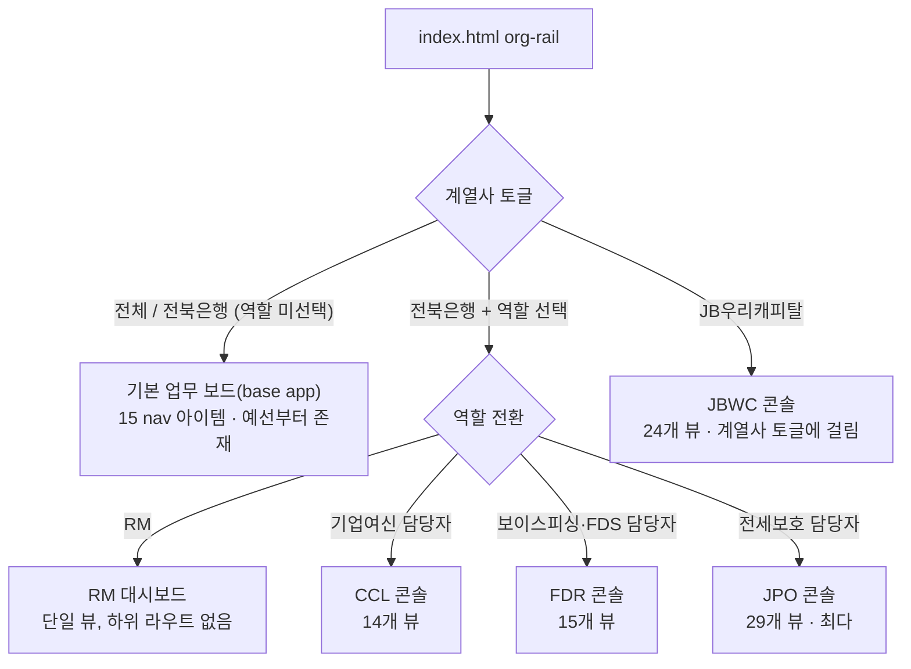

# 화면목록 · 뷰맵 — 계열사×역할 양축 전체(JB_project2 파리티)

> **문제의식**: 지금까지 정보체계 문서(`06-정보체계-뷰-데이터바인딩-스펙`)와 설계도 5종은 **CCL(기업여신) 콘솔 1개**를 근거로 `S-ID` 카탈로그와 역할-generic ViewModel(`CaseQueueItem`, `AgentRun` 등)을 확정했다. 그런데 실제 구현체 `_vendor/JB_project2/app/`은 **6개 진입점 · 4개 역할축 콘솔 · 계열사 토글 1개(JBWC)**로 이미 갈라져 있고, FDR/JPO/JBWC에는 CCL에 없는 도메인 전용 화면(등기부 확인, 전세피해자 신청, 차량 생애주기 등)이 다수 존재한다. 이 문서는 **구현현황-JB_project2.md에 실제로 나열된 뷰 키 전량**을 하나도 빠뜨리지 않고 계열사×역할 양축 위에 배치하고, 각 뷰를 (a) 기존 generic 템플릿(S-ID/설계도)으로 커버되는지 (b) 도메인 전용 명세가 새로 필요한지로 판정한다.

> **실측 주의**: `구현현황-JB_project2.md` §2는 콘솔별 뷰 개수를 "CCL 13·FDR 15·JPO 25·JBWC 22"로 요약하지만, 같은 절에 백틱으로 나열된 실제 키 목록을 직접 세면 **CCL 14·FDR 15·JPO 29·JBWC 24**로 헤더 요약과 불일치한다(FDR만 일치). 이 문서는 요약 숫자가 아니라 **나열된 키 원문**을 그대로 옮겼다 — 아래 표의 행 수가 실제 카운트다. 콘솔 헤더 숫자(13/25/22)는 원본 문서의 오기로 보이며, `구현현황-JB_project2.md` 쪽 수정이 별도로 필요하다(이 문서의 범위 밖).

## 1. 양축 모델

계열사 축과 역할 축은 **같은 토글이 아니다**. `org-rail`은 계열사 전환(전체/전북은행/JB우리캐피탈)과 역할 전환(RM/기업여신/전세보호/보이스피싱·FDS)을 별도 컨트롤로 노출하고, 실제 라우팅(`applyHashRoute()`, app.js:5705)은 4개 역할 콘솔의 해시 라우트를 순서대로 시도(jbwc → jpo → ccl → fdr)한 뒤에야 base app `navigation` 배열로 폴백한다.

| 축 | 값 | 걸리는 진입점 | 코드 근거 |
|---|---|---|---|
| 계열사(affiliate) | 전체 / 전북은행 / JB우리캐피탈 | 전체·전북은행 → base app 또는 역할 콘솔 3종. JB우리캐피탈 → **JBWC 콘솔 전용**(역할 전환이 아니라 계열사 전환에 걸림) | `jbWooriCapitalSidebar.config.js:132-157` |
| 역할(role) | RM / 기업여신 / 전세보호 / 보이스피싱·FDS | RM → `rm-dashboard` 단일 뷰. 기업여신 → CCL. 전세보호 → JPO. 보이스피싱·FDS → FDR | `cclConsole.core.js`, `fdrConsole.core.js`, `jeonseProtection.config.js` |
| (역할 아님, base 전용) | 사후관리/준법 | base app `navigation`(15개 nav 아이템: 업무보드·승인함·감사기록 등)이 사후관리·준법 업무를 대신 흡수 — 전용 콘솔 없음 | `app.js:2-33` |

**결론**: 6개 진입점 = base app + rm-dashboard + CCL + FDR + JPO + JBWC. "콘솔 4개"라는 통칭은 base와 RM을 빠뜨린 표현이다.

## 2. 콘솔별 전체 뷰 매핑 표

범례: **[generic]** = 기존 S-ID/설계도 템플릿이 그대로 또는 라벨만 바꿔 커버. **[신규 특화 명세 필요]** = 콘솔 고유 로직/데이터라 새 명세 없이는 못 그림. **[부분특화]** = generic 골격은 재사용하되 도메인 필드가 남는 경계 사례. `[추정]` = 키 이름에서 역할을 추론(구현 코드의 필드/함수까지 확인하지 않음).

### 2.1 기업여신 담당자(CCL) — 14개 뷰

| 뷰 키                 | 판정        | 매핑                                         | 비고                                |
| ------------------- | --------- | ------------------------------------------ | --------------------------------- |
| `board`             | [generic] | `S-03` / 설계도01                             | 6컬럼 칸반, 플래그십 템플릿의 원본              |
| `cases`             | [generic] | `S-03`                                     | 전체 케이스 리스트(보드의 테이블 변형)            |
| `cases-new`         | [generic] | `S-03-create`                              | 케이스 생성 위저드                        |
| `doc-check`         | [generic] | `S-03-detail` 근거탭(EvidencePack `DocCheck`) |                                   |
| `approval-drafts`   | [generic] | `S-04` / 설계도04                             | 승인대기함                             |
| `financial-summary` | [generic] | `S-03-detail` 근거탭(EvidencePack)            | CCL 라벨이지만 구조는 Signal/Evidence 재사용 |
| `repayment-check`   | [generic] | `S-03-detail` 위험신호탭(Signal)                |                                   |
| `policy-match`      | [generic] | `S-03-detail` 근거탭(EvidencePack)            | 정책금융 매칭 근거                        |
| `early-warning`     | [generic] | `S-03-detail` 위험신호탭(Signal)                |                                   |
| `consult-log`       | [generic] | `S-03-detail` 근거탭(EvidencePack)            |                                   |
| `reply-drafts`      | [generic] | `S-04`(RecommendationDraft)                | 고객 회신 초안                          |
| `ai-analysis`       | [generic] | `S-05` / 설계도03                             | AI 분석 요청 큐                        |
| `agent-harness`     | [generic] | `S-05` / 설계도03                             |                                   |
| `audit-logs`        | [generic] | `S-13`                                     |                                   |

**CCL 소계: 14/14 generic-covered.** 팀장 우려대로 S-ID 카탈로그가 CCL 그대로에서 나왔다는 게 이 표에서 확인된다 — CCL은 새 명세가 필요 없다.

### 2.2 FDS/보이스피싱 담당자(FDR) — 15개 뷰

| 뷰 키 | 판정 | 매핑 | 비고 |
|---|---|---|---|
| `board` | [generic] | `S-03` | |
| `cases` | [generic] | `S-03` | |
| `cases-new` | [generic] | `S-03-create` | |
| `block-review` | **[신규 특화 명세 필요]** | 없음 | 의심거래 **차단** 여부 심사 — 승인/거부 2분법이 아니라 "차단 유지/해제" 결정 구조라 `S-04` ApprovalRecord 상태모델과 다르다 |
| `escalations` | **[신규 특화 명세 필요]** | `S-04` 변형(부분) | 상급자 긴급 에스컬레이션 큐. FDS 특유의 긴급도 규칙 `[추정]` |
| `anomaly-signals` | [generic] | `S-03-detail` 위험신호탭(Signal) | |
| `elder-guard` | **[신규 특화 명세 필요]** | 없음 | 고령층 등 취약고객 전용 보호 심사 뷰 `[추정]` — 별도 취약계층 판별 신호·안내 문구 체계 필요 |
| `pattern-summary` | [generic] | `S-03-detail` 근거탭(EvidencePack) | |
| `rule-status` | **[신규 특화 명세 필요]** | 없음 | FDS 탐지룰 on/off·정확도 운영 대시보드 `[추정]` — S-16 소스config와 인접하나 룰 엔진 전용 필드 없음 |
| `contact-scripts` | [generic] | `S-04`(RecommendationDraft) | 고객 응대 스크립트 초안 |
| `payment-hold-guide` | **[신규 특화 명세 필요]** | 없음 | 지급정지 절차 안내 — 은행 지급정지 실무 특유 단계 `[추정]` |
| `follow-up` | [generic] | `S-03-detail` | 후속조치 상태 추적 |
| `ai-analysis` | [generic] | `S-05` | |
| `agent-harness` | [generic] | `S-05` | |
| `audit-logs` | [generic] | `S-13` | |

**FDR 소계: 10/15 generic, 5/15 신규 특화 필요**(`block-review`, `escalations`, `elder-guard`, `rule-status`, `payment-hold-guide`).

### 2.3 전세보호 담당자(JPO) — 29개 뷰 (콘솔 중 최다)

| 뷰 키 | 판정 | 매핑 | 비고 |
|---|---|---|---|
| `board` | [generic] | `S-03` | |
| `cases` | [generic] | `S-03` | |
| `cases-new` | [generic] | `S-03-create` | |
| `price-enrich` | **[신규 특화 명세 필요]** | 없음 | 시세 데이터 보강 파이프라인 뷰 `[추정]` |
| `registry-check` | **[신규 특화 명세 필요]** | 없음 | 등기부등본 확인(과제 예시 지정) |
| `guarantee-check` | **[신규 특화 명세 필요]** | 없음 | 전세보증보험 가입/이력 확인 `[추정]` |
| `victim-application` | **[신규 특화 명세 필요]** | 없음 | 전세사기 피해자 결정 신청/접수(과제 예시 지정) |
| `urgent-auction` | **[신규 특화 명세 필요]** | 없음 | 긴급 경매 대응 케이스(과제 예시 지정) |
| `price-risk` | [generic] | `S-03-detail` 위험신호탭(Signal) | |
| `rent-comparables` | **[신규 특화 명세 필요]** | 없음 | 인근 전월세 실거래 비교 데이터 뷰 `[추정]` |
| `sale-comparables` | **[신규 특화 명세 필요]** | 없음 | 인근 매매 실거래 비교 데이터 뷰 `[추정]` |
| `official-price` | **[신규 특화 명세 필요]** | 없음 | 공시가격 조회(과제 예시 지정) |
| `building-check` | **[신규 특화 명세 필요]** | 없음 | 건축물대장/권리관계 확인 `[추정]` |
| `landlord-risk` | [generic] | `S-03-detail` 위험신호탭(Signal) | 임대인 리스크 신호 |
| `intake-consult` | [generic] | `S-03-detail` 근거탭 | CCL `consult-log` 패턴 재사용 |
| `victim-guide` | **[신규 특화 명세 필요]** | 없음 | 피해자 지원 절차 안내 콘텐츠 `[추정]` |
| `doc-checklist` | [generic] | `S-03-detail` 근거탭(EvidencePack DocCheck) | |
| `legal-referral` | **[신규 특화 명세 필요]** | 없음 | 법률 지원기관 연계 `[추정]` |
| `finance-housing-referral` | **[신규 특화 명세 필요]** | 없음 | 금융·주거지원 연계 `[추정]` |
| `care-referral` | **[신규 특화 명세 필요]** | 없음 | 돌봄·복지 지원 연계 `[추정]` |
| `support-referral` | **[신규 특화 명세 필요]** | 없음 | 종합 지원기관 연계 `[추정]` — `care-referral`과 범위 중복 가능성, 명세 시 통합 검토 필요 |
| `ai-analysis` | [generic] | `S-05` | |
| `ai-consult-summary` | [generic] | `S-05` 출력 요약 | |
| `agent-harness` | [generic] | `S-05` | |
| `data-connectors` | [generic] | `S-12`(external_connectors ViewModel) | |
| `roles` | [generic] | `S-07`/`S-08` | |
| `audit-logs` | [generic] | `S-13` | |
| `inspections` | [부분특화] | 없음(부분) | 정기점검 스케줄 — base app `routines`와 개념 유사하나 전용 S-ID 없음 `[추정]` |
| `case-full` | [generic] | `S-03-detail` 확장판 | |

**JPO 소계: 14/29 generic, 15/29 신규 특화 필요.** JPO가 절대 건수·특화 건수 모두 최다 — 전세보호는 CCL 기반 카탈로그로 가장 안 덮이는 도메인이다.

### 2.4 JB우리캐피탈(JBWC) — 24개 뷰

| 뷰 키 | 판정 | 매핑 | 비고 |
|---|---|---|---|
| `board` | [generic] | `S-03` | |
| `approvals` | [generic] | `S-04` | |
| `audit-logs` | [generic] | `S-13` | |
| `privacy-permissions` | [generic] | `S-16`(PII/정책 설정) | |
| `integrations` | [generic] | `S-12`(커넥터) | |
| `cases` | [generic] | `S-03` | |
| `cases-new` | [generic] | `S-03-create` | |
| `ai-analysis` | [generic] | `S-05` | |
| `ai-assist` | [generic] | `S-05` | |
| `capabilities` | [generic] | `S-11`(스킬/능력 목록) | |
| `roles` | [generic] | `S-07`/`S-08` | |
| `inspections` | [부분특화] | 없음(부분) | JPO와 동일한 경계 사례 |
| `consumer-protection` | **[신규 특화 명세 필요]** | 없음 | 금융소비자보호법 심사 뷰 `[추정]` |
| `alerts` | [generic] | `S-02`(알림) | |
| `personal-finance` | **[신규 특화 명세 필요]** | 없음 | 개인금융 상품 케이스군 `[추정]` |
| `auto-finance` | **[신규 특화 명세 필요]** | 없음 | 오토론/자동차금융 상품 케이스군(과제 예시 지정) |
| `mortgage-secured` | **[신규 특화 명세 필요]** | 없음 | 담보·모기지 상품 케이스군(과제 예시 지정) |
| `enterprise-finance` | **[신규 특화 명세 필요]** | 없음 | 기업금융(캐피탈) 케이스군 `[추정]` |
| `customer-management` | **[신규 특화 명세 필요]** | 없음 | 고객 등록/관리(CRM성) 뷰 `[추정]` |
| `documents` | [generic] | `S-03-detail` 근거탭(EvidencePack) | |
| `vehicle-lifecycle` | **[신규 특화 명세 필요]** | 없음 | 차량 생애주기(등록~폐차) 관리(과제 예시 지정) |
| `fds` | **[신규 특화 명세 필요]** | 없음 | JBWC 내 FDS 연동 — FDR 콘솔 패턴 재사용 가능하나 캐피탈 고유 사기유형 `[추정]` |
| `complaints` | **[신규 특화 명세 필요]** | 없음 | 고객 불만·민원 처리 뷰 `[추정]` |
| `agent-harness` | [generic] | `S-05` | |

**JBWC 소계: 14/24 generic, 10/24 신규 특화 필요**(`consumer-protection`, `personal-finance`, `auto-finance`, `mortgage-secured`, `enterprise-finance`, `customer-management`, `vehicle-lifecycle`, `fds`, `complaints`, `inspections`).

### 2.5 원본 업무 보드(base app) — 15개 뷰

| 뷰 키 | 판정 | 매핑 | 비고 |
|---|---|---|---|
| `dashboard` | [generic] | `S-03` / 설계도01 | |
| `approvals` | [generic] | `S-04` / 설계도04 | |
| `activity` | [generic] | `S-13` | |
| `settings` | [generic] | `S-16` | |
| `plugins` | [generic] | `S-12` | |
| `cases` | [generic] | `S-03` | |
| `runs` | [generic] | `S-05` / 설계도03 | |
| `agents` | [generic] | `S-07`/`S-08` | |
| `skills` | [generic] | `S-11` | |
| `orgchart` | [generic] | `S-07`/`S-08` | |
| `routines` | [generic] | `S-16` 인접(정기 점검 설정) | |
| `jeonse` | [부분특화] | 없음(부분) | "전세 안심 점검 확장 로드맵" 예고 링크 — 실제 콘텐츠는 JPO 콘솔이 담당, base 자체는 안내 스텁이라 별도 명세 불요 |
| `inbox` | [generic] | `S-02` | |
| `goals` | [generic] | 설계도05 인접(운영목표/SLA) | |
| `budget` | [generic] | 설계도05(토큰·원가 계기판 + §9 전방위 관측 카탈로그) | 정확히 일치. §9 확장 이후 이 패널은 토큰뿐 아니라 운영·AI실행·가드레일·비용·메모리·감사 6영역 지표를 같은 화면에서 스코프 전환(전사↔에이전트별)으로 보여주는 자리로 재정의됨 |

**base 소계: 14/15 generic, 1/15 부분특화**(`jeonse` 예고 스텁).

### 2.6 RM 대시보드 — 1개 뷰

| 뷰 키            | 판정     | 매핑     | 비고                                                                                                                        |
| -------------- | ------ | ------ | ------------------------------------------------------------------------------------------------------------------------- |
| `rm-dashboard` | [부분특화] | 없음(부분) | 역할=RM 진입 시 뜨는 단일 페이지(`app.js:1769 rmDashboardPage`), 하위 라우트 없음. `CaseQueueItem` 골격 재사용 가능하나 RM 전용 KPI 조합·집계 로직은 미정 `[추정]` |

## 3. 커버리지 요약

| 콘솔 | 전체 뷰 | generic-covered | 신규 특화 명세 필요 | 부분특화(경계) |
|---|---:|---:|---:|---:|
| CCL | 14 | 14 | 0 | 0 |
| FDR | 15 | 10 | 5 | 0 |
| JPO | 29 | 14 | 15 | 0 |
| JBWC | 24 | 14 | 9 | 1(`inspections`) |
| base app | 15 | 14 | 0 | 1(`jeonse`) |
| rm-dashboard | 1 | 0 | 0 | 1 |
| **합계** | **98** | **66** | **29** | **3** |

**파리티 판정**: 원 과제 지시가 인용한 "91개 뷰"는 `구현현황-JB_project2.md` §2의 콘솔별 헤더 요약(13+15+25+22+15+1)을 그대로 합산한 값이다. 그러나 같은 문서에 실제로 나열된 뷰 키 원문을 세면 **98개**(CCL 14·FDR 15·JPO 29·JBWC 24·base 15·rm-dashboard 1)이고, 이 문서는 그 98개 전량을 빠짐없이 매핑했다. **양적 파리티는 91이 아니라 98 기준으로 달성**했다 — 헤더 요약 쪽이 실측 오기였다.

질적으로는: **66/98(67%)은 기존 CCL 기반 generic 템플릿(S-ID/설계도)으로 커버되지만, 29/98(30%)은 콘솔 고유 도메인 로직이라 새 명세 없이는 와이어프레임을 못 그린다.** 팀장 우려("CCL 하나로 다 퉁쳤다")는 사실이었고 — 특히 JPO(15개, 절반 이상)와 JBWC(9개)가 특화 명세 부채의 대부분이다. FDR은 5개로 상대적으로 적다. **파리티 미달**: 뷰 목록 자체는 이제 전량 확보했지만, 29개 특화 뷰의 ASCII 와이어프레임·컴포넌트 트리·데이터 바인딩은 이 문서가 아니라 후속 설계도(06~10번대, 콘솔별)로 넘어가야 완성된다.

## 4. 최소 MVP 시연 뷰 셋

본선 시연은 **2개 계열사**(전북은행 + JB우리캐피탈)만 보여주며, 히어로 케이스는 `CCL-0001`(전주 카페 운영자 운전자금 검토)이다. 아래는 그 시연이 실제로 여는 화면만 남긴 최소 셋 — 나머지 뷰는 "존재는 하되 이번 데모에서 열지 않는다."

| 우선순위 | 뷰 키 | 콘솔 | 이유 |
|---|---|---|---|
| 1 | `board` | CCL | 히어로 진입점, 6컬럼 칸반 |
| 2 | `cases-new` 또는 케이스 선택 | CCL | `CCL-0001` 워크플로 시작 |
| 3 | 케이스상세(`S-03-detail`, CCL board 드릴인) | CCL | 근거·실행·승인·감사 통합 뷰 |
| 4 | `agent-harness`/`ai-analysis`(activityLog) | CCL | 에이전트 실행 애니메이션(FR-18·21) 시연 |
| 5 | `approval-drafts` + 승인 상세 | CCL | 3분할 결정 화면, Enter-first 승인 |
| 6 | `audit-logs` | CCL | 감사 타임라인 봉인 |
| 7 | `board` | JBWC | "2계열사" 주장의 실제 증거 — 계열사 토글 전환 시연 |
| 8 | 조직도(`orgchart`/`S-07`) | 공통 | 발표 킥(FR-11), 14개 에이전트 R&R 한눈에 |

**시연 임계 뷰 개수: 8개** (전체 98개 중 8%). 나머지 90개는 "콘솔이 이만큼 넓다"는 근거 자료로만 남기고 실연은 CCL 골든패스 + JBWC 토글 증거 한 컷으로 좁힌다. FDR·JPO는 이번 시연 셋에는 없다 — 필요하면 팀 확정 시 JPO 히어로(전세보호) 1개 뷰를 9번으로 추가하는 정도가 안전선이다.

## 5. 연결

- [[구현현황-JB_project2]] — 코드 실측 SSOT, 이 문서의 91→98 재계산 근거
- [[06-정보체계-뷰-데이터바인딩-스펙]] — S-00~S-17 카탈로그, ViewModel, 계열사×역할×케이스 3축(§2.1)
- [[_설계도-INDEX|설계도 인덱스]] — 5종 청사진(01~05) 목록
- [[01-메인-업무보드]] · [[02-케이스-상세]] · [[03-에이전트-실행뷰]] · [[04-승인-대기·결정]] · [[05-통계-추적-패널]]
