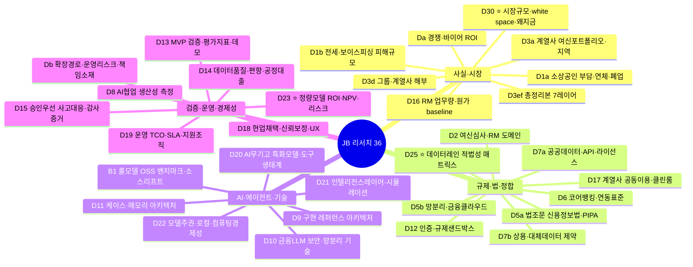

---
tags:
  - area/strategy
  - type/map
  - status/active
date: 2026-07-02
up: "[[_00-회수현황]]"
aliases:
  - 리서치-지도
  - research-atlas
---
> ⚠️ 대외비. **리서치 한눈 지도** — 36건 각각의 핵심을 클러스터로 배치. 팀원(Obsidian 렌더) + AI(텍스트 파싱) 공용. 각 노드 상세 = [[_00-회수현황]] · 교차 인사이트 = [[_인사이트맵]] · 조립 = [[JB-도입시나리오-설득패키지]]. ⭐=발표 핵심.

# 리서치 지도 (Research Atlas)

## 클러스터별 한 줄 결론 (so-what)
| 클러스터 | 대표 결론 | 발표 쓰임 |
|---|---|---|
| **사실·시장** | 시장은 실재하고(TAM 1,100~2,200억) 빈칸이 있다(승인우선+PII로컬+계열사 이식 동시 충족 부재). | 심사 1·2 — 문제·기회 |
| **규제·법·정합** | 원본 PII 외부반출 금지근접·SaaS예외도 개인신용정보 불허 → "PII 비반출·로컬우선"이 **조문에 걸린 설계**. | 심사 3·5 — 신뢰·방어 |
| **AI·에이전트·기술** | LLM은 본체가 아니라 특화모델·룰·도구를 부리는 **오케스트레이터**. "하네스가 좋으면 모델은 그 안에서 작동." | 심사 3 — Agent 설계 |
| **검증·운영·경제성** | 완성도는 "좋은 답변"이 아니라 **상태변화 불변식**·보수 ROI·재작업/자본구제. | 심사 4·5 — 완성도·확장 |

## 읽는 법
- **노드 클릭 대상**: 각 코드의 결과는 [[_00-회수현황]]에서 링크로 이동(예: [[D30-결과]]·[[D25-결과]]·[[D23-결과-gpt55pro]]).
- **관계(강화/충돌)**: 개별 리서치가 아니라 8개 교차 인사이트로 얽히는 관계는 [[_인사이트맵]] 점-점 매트릭스 참조.
- **렌더**: Obsidian 자동 렌더. 정적 이미지가 필요하면 `02_제품/scripts/render_mermaid.mjs`.
