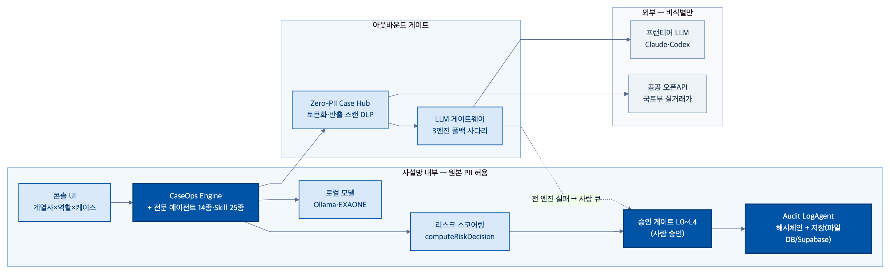
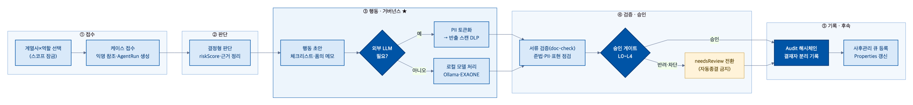

JB금융그룹 Fin:AI Challenge 기능 명세서

팀명
GoLAB
주제 구분
자유주제
팀원 정보(역할)
이승보:개발 | 이재형:개발 | 김주용:PM | 김민주:디자인
작성일
2026.07.05

1. 서비스 개요 (Service)
서비스명
JByond (구 JB LocalGuard OS)
서비스 한줄 소개
금융 케이스가 들어오면 AI 에이전트가 근거를 정리하고, 사람은 승인하며, 모든 판단과 데이터 사용이 감사 로그로 남는 금융 AI 운영 콘솔
개발 목표
은행 RM·심사·사후관리·준법 담당자는 한 사람이 수십~수백 케이스를 보지만, 위험 신호가 흩어져 있어 조기에 모아 판단하고 다음 행동으로 잇기 어렵다. 이 흩어진 위험을 하나의 케이스로 모아 '판단 → 행동 초안 → 검증 → 사람 승인 → 감사 기록'으로 연결하는 승인·감사형 운영체계를 만드는 것이 목표다. 본선에서는 예선 단일 계열사·단일 콘솔 구조를 전북은행 + JB우리캐피탈 2개 계열사 × 역할 콘솔 4종(기업여신·보이스피싱·전세보호·RM) × 케이스 구조로 확장했다.
타겟 사용자
1차 사용자 — 전북은행·JB우리캐피탈의 RM·기업금융 심사역·사후관리·준법/리스크 담당자. 최종 수혜자 — 전북 기반 소상공인·개인사업자·전세 계약 고객, JB우리캐피탈 여신 고객.
기대 효과
운영 KPI(예선 계승) — 위험 인지→대응 착수 시간 50% 단축 · 고객 대상 행동 100% 사람 승인 통과(fail-closed) · 판단 100% 근거 연결. 정량 효과(발표 추정 모델) — RM 1인당 연 360건 처리·건당 20분 절감(실현율 55%→연 66시간), 3년 NPV 24.2억·ROI 471%·회수 5.4개월; 시스템 실측 응답 1.0~1.1초(Playwright 계측, 추정치와 구분).

2. 시스템 구성도 (Architecture)
운영 계약(예선과 동일 골격): 케이스(Case) → AgentRun → 전문 에이전트 14종(본선 콘솔 확장 포함 58종) → 스킬 25종(확장 40종) → Evidence → Zero-PII Case Hub(데이터 거버넌스) → L0~L4 승인 게이트(사람) → Audit LogAgent(감사 원장).



신뢰 경계 3구획: 사설망 내부(원본 PII 허용) → 아웃바운드 게이트(토큰화 프록시+반출 스캔 DLP) → 외부(비식별만, 프런티어 LLM·공공 오픈API).

3. 핵심 기능 명세 (Feature Specification)
데모등급: O = 실동작 확인 / △ = 부분·목업 병행 / 예정 = 설계만, 코드 미구현.

| 기능명 | 기능 설명 | 입력/출력 데이터 | 관련 기술 및 알고리즘 | 구현 여부 |
|---|---|---|---|---|
| 케이스 운영보드·대시보드 | 케이스를 위험·상태·SLA로 큐잉, 칸반 이동이 실제 상태 전환을 발화 — 본선에서 계열사×역할 콘솔별 독립 보드로 확장 | 입력: 케이스 큐 / 출력: 위험·상태 보드 | 상태머신(`moveCaseToColumn`) | O |
| 역할별 콘솔 4종(기업여신·보이스피싱·전세보호·RM) + 계열사 콘솔(JB우리캐피탈) | 계열사×직군 축으로 콘솔 분리, 콘솔별 독립 스코프 격리 DB | 입력: 계열사/역할 선택 / 출력: 전용 뷰·라우트 | 해시라우팅(`applyHashRoute`), scope 격리 | △(기업여신·전세보호·RM+계열사 콘솔 실동작 · 보이스피싱 콘솔은 스크립트 미탑재로 미로드) |
| AgentRun 실행(결정형) | 케이스 지시 시 담당 에이전트가 단계별 판단 로그(근거)를 시간순 생성 | 입력: 케이스+RiskSignal / 출력: 단계별 판단 로그 | CaseOps Engine, `decisionSnapshot` | O(결정형 기본흐름)/△(기본은 목업, ollama는 opt-in 별도) |
| 리스크 스코어링 | 위험 신호 가중합으로 riskScore·승인 레벨(L0~L4) 산정 | 입력: RiskSignal[] / 출력: riskScore·band | `computeRiskDecision`(결정론적 가중합) | O |
| 승인 게이트(L0~L4) | 고객 대상 행동 전 사람 승인, 승인/반려/수정후승인만 허용 | 입력: 제안 행동 / 출력: 승인·반려 상태전이 | `approvalLevelMatrix` | O |
| 감사 기록(Audit LogAgent, 해시체인) | 판단·승인·차단 이력을 append-only 원장으로 기록 — 해시체인은 기본 콘솔 적용, 역할 콘솔 확대 예정 | 입력: 이벤트 스트림 / 출력: 해시체인 레코드 | `auditChainRecords`(FNV-1a) | O(기본 콘솔)/△(역할 콘솔 4종은 평문) |
| PII 가드레일·데이터 거버넌스 | 외부 전송 페이로드 PII/금지표현 검사·차단 + 등급별(restricted~public) 모델 라우팅 — 본선에서 정규식 PII 가드레일(harnessCore)·런타임 자체검증(self-test) 실동작으로 승격 | 입력: 데이터·전송 후보 / 출력: 차단·경고 결과, 라우팅 표 | `harnessCore.js`, `dataGovernance.tiers` | O |
| LLM 게이트웨이 + Ollama 로컬 연동 | claude/codex/ollama 3엔진 라우팅+폴백 사다리, 로컬 Ollama 중계·금지표현 필터링 | 입력: 프롬프트+엔진 지정 / 출력: 응답+원가 로그 | `llm-gateway.mjs`, `ollama-agent-proxy.mjs`(:8030) | O(ollama 단일엔진, CCR·RM 2콘솔 opt-in 버튼)/△(claude·codex 포함 3엔진 폴백사다리 `llm-gateway.mjs`는 fork PR 미병합·UI 미배선) |
| 전세 Shield 라인(공공데이터 라이브) | 전세가율·권리관계 진단, 실거래가 라이브 조회 — 본선에서 국토부 실거래가 라이브 조회(`?live=1`) 실연동 | 입력: 전세 케이스 / 출력: 진단·체크리스트 | 국토부 실거래가 API(`?live=1`) | O(라이브 조회)/△(나머지 seed) |
| 메모리 3계층(MemoryCard) | 승인/반려 결정을 규칙으로 증류해 재사용, PII 원문 저장 금지 | 입력: 승인 결정 / 출력: 메모리 카드 | `memoryCards.js`(PR 제출·머지대기) | △(fork 브랜치) |

4. 주요 기능 흐름도 (Flow)
골든패스 9스텝(히어로 케이스 CCL-0001, 전주 카페 소상공인 여신):
① 로그인·계열사×역할 선택 → ② 케이스보드 진입 → ③ 케이스 생성(신규 접수) → ④ 상세·자료 수집 → ⑤ 에이전트 실행뷰(판단: 재무·상환위험) → ⑥ 행동 초안(서류 체크리스트·정책금융 후보·품의 메모) → ⑦ 승인대기함 진입(초안·근거·규정검증 동시 표시) → ⑧ 승인/거부/수정후승인(승인 전이 이벤트만 발송 트리거) → ⑨ 감사 기록 + 사후관리 큐 등록.

결정 규칙: riskScore 임계 이상 또는 이상거래 감지 시 승인·준법 통과 전 외부 행동 차단. 예외 흐름: PII·단정 표현 위반 시 케이스 생성·발송 자체 차단, 고위험 케이스는 자동 완료 금지(needsReview 강제).



5. 향후 발전 방향 (Future Work)
· 데이터·모델 — 공공데이터 API 정식 연동 확대, 온프레·외부 모델 하이브리드 라우팅 고도화(LLM 게이트웨이 확대).
· 백엔드 승격 — 4함수 계약(computeRiskDecision·buildDashboardData·auditChainRecords·moveCaseToColumn)을 `server/` API로 완전 이관, 감사 해시체인을 전 콘솔로 통일 적용.
· 협업 기능 — 케이스=마크다운 export, 코멘트/피드백 기능 구현.
· 확장 경로 — PoC→파일럿(1개 영업본부 RM)→내부 적용→고객 서비스화, 계열사(광주은행 등 그룹 전체)·운영 에이전트(원가 파수꾼·사고 승격·감사 원장 큐레이터)·메모리 카드(승인 결정의 규칙 증류)로 확장.

6. 부록 (Appendix)
· 검증 수치 — 전세사기 피해자 39,121건(국토교통부, 2026-06-09) · HUG 보증사고액 2024년 4조4,896억원→2025년 1조2,446억원(-72.3%) · 보이스피싱 피해 1조1,330억원(+56.1% YoY, 금융위·경찰청) · 자영업자 취약차주 42.7만명(13.7%, 한국은행) · 자영업자 연체율(한국은행 1.67%·비은행 3.43%) · [JB금융그룹 FY2025 순익 7,104억원·ROE 12.4%](https://www.jbfg.com/ko/prcenter/press/detail/20.do)(JB금융지주 실적발표, 순이익은 DART 교차확인).
· 데이터·API — [한국은행 ECOS](https://ecos.bok.or.kr/api/) · [국토부 실거래가](https://rt.molit.go.kr)(OpenAPI, `?live=1` 라이브 실연동) · [HUG 전세보증](https://www.khug.or.kr/hug/web/ig/dr/igdr000001.jsp) · [대법원 등기 Open API](https://www.iros.go.kr) · [NVIDIA Nemotron-Personas-Korea](https://huggingface.co/datasets/nvidia/Nemotron-Personas-Korea)(PII 없는 합성 데모 시드, 케이스·조직도 데이터는 내부 목업) · Claude/Codex CLI(비식별 입력만) · Ollama·[EXAONE 3.5](https://huggingface.co/LGAI-EXAONE/EXAONE-3.5-7.8B-Instruct/blob/main/LICENSE)(로컬).
· 법적 근거 — [신용정보법 §40조의2](https://www.law.go.kr/%EB%B2%95%EB%A0%B9/%EC%8B%A0%EC%9A%A9%EC%A0%95%EB%B3%B4%EC%9D%98%EC%9D%B4%EC%9A%A9%EB%B0%8F%EB%B3%B4%ED%98%B8%EC%97%90%EA%B4%80%ED%95%9C%EB%B2%95%EB%A5%A0)(가명처리·재식별금지)·[§36조의2](https://www.law.go.kr/LSW/lsInfoP.do?lsiSeq=140586)(자동화평가 설명요구권) · [개인정보보호법 §28조의4·§28조의5](https://www.law.go.kr/%EB%B2%95%EB%A0%B9/%EA%B0%9C%EC%9D%B8%EC%A0%95%EB%B3%B4%EB%B3%B4%ED%98%B8%EB%B2%95) · [전자금융감독규정 §15조](https://www.law.go.kr/%ED%96%89%EC%A0%95%EA%B7%9C%EC%B9%99/%EC%A0%84%EC%9E%90%EA%B8%88%EC%9C%B5%EA%B0%90%EB%8F%85%EA%B7%9C%EC%A0%95)(망분리) · [AI기본법 §34](https://www.law.go.kr/lsInfoP.do?lsiSeq=268543)(고영향 AI 사람 관리·감독) · [금융위 망분리 개선 로드맵](https://www.fsc.go.kr/no010101/82885)(2024-08-13).
· 저장소·검증 — [GitHub LSB-afk/JB-Fin-AI-Challenge](https://github.com/LSB-afk/JB-Fin-AI-Challenge)(예선) → [LSB-afk/JB_project2](https://github.com/LSB-afk/JB_project2)(본선 코드 정본) · `verify_static.py` + Playwright E2E · 코드 실측 기준 2026-07-05(에이전트 58·스킬 40 등록).
· 별첨 — MVP 제안서(공식 7섹션) · 발표 데크(JByond) · 시연 런북(Docker PII 물리분리) · 04_아키텍처 Mermaid 다이어그램.

7. 기능 변경이력 (Change Log)

| 변경 일자 | 변경 대상 기능 | 변경 내용 | 변경 사유 |
|---|---|---|---|
| 2026.06.11 | 초기 MVP 베이스라인 | LocalGuard 콘솔 골격·에이전트 모델·전세 Shield 라인 구성 | 예선 MVP 착수 |
| 2026.06.12 | 라이브 상호작용·제안서 데크 | 인박스·승인 큐·운영 루프 가동, 공식 양식 제안서 데크 초안 | 동작 검증·제출물 준비 |
| 2026.06.13 | UI 밀도·디자인 시스템 | 결정 밀도 정제, 데이터 시각화·용어·정보 위계 단계 정제 | 가독성·완성도 향상 |
| 2026.06.14 | 거버넌스·문서 체계 | PII 비반출 거버넌스, 법령 인용, 공식 제안서·기능명세서 정합 | 차별점 강화·일관성 확보 |
| 2026.07.02 | 콘솔 구조 확장 | 전북은행+JB우리캐피탈 2계열사, 역할별 콘솔 4종(기업여신·보이스피싱·전세보호·RM) 신설 + JB우리캐피탈 계열사 콘솔 분리 — 히어로 케이스 CCL-0001로 이관 | 계열사·업무영역 확장 요건 대응 |
| 2026.07.04 | LLM 게이트웨이+Ollama 로컬 연동 | claude/codex/ollama 3엔진 라우팅+폴백 사다리 신설, 로컬 Ollama 중계 프록시 추가 | 비용·장애 대응 실동작 증명, PII 보호 |
| 2026.07.04 | 메모리 3계층(MemoryCard) | 승인/반려 결정을 규칙으로 증류하는 기능 신설(PR 제출, fork 브랜치 검증) | 반복 업무 학습 루프 근거 마련 |
| 2026.07.04 | Docker PII 물리분리 + 공공데이터 실연동 | PII존·외부망 컨테이너 분리 시연 런북 추가, 국토부 실거래가 라이브 조회(`?live=1`) 본선 코드 반영 | 망분리 규정 실증·데이터 기반 심사 근거(예선 "(예정) 실데이터·모델 연동" 이행) |
| 2026.07.04 | 백엔드 신설 + 감사범위 정정 | `server/` 옵션 백엔드(파일DB/Supabase) 신설, 감사 해시체인이 기본 콘솔에만 적용됨을 정정 명시 | 서버 승격 착수(예선 "(예정) 백엔드 승격" 이행), 코드 실측 정합·과장 방지 |
| 2026.07.05 | 서비스명 리브랜딩 | JB LocalGuard OS → JByond(구 명칭 병기) | 본선 발표 브랜드 정비 |

<!-- 제출본에서 제외된 상세 (콘텐츠 정본 보존용 — 3페이지 예산 초과로 발췌) -->

## 2장 상세 (5레이어·하이브리드 라우팅·텍스트 요약)

5레이어 구성
① 콘솔 UI(3열 셸) — 사람의 유일 접점. org-rail(계열사×역할 전환)·워크벤치(큐·칸반·승인함)·컨텍스트 패널. 승인 전 자동발송 UI 미노출.
② API Gateway — 인증·역할 검사 + 아웃바운드 단일 관문(DLP 반출 스캔·토큰화 프록시).
③ CaseOps Engine(에이전트 오케스트레이션) — 케이스 라우팅 → 전문 에이전트에 Skill 부착 실행, 승인 게이트 통과분만 고객 대상 행동 허용.
④ RAG + 규칙엔진 — 판단에 근거 부착. RAG는 Evidence 검색, 규칙엔진은 신호 계산 → 승인 레벨 라우팅.
⑤ 데이터·감사 — 7단 계약 영속 + Audit append-only 원장.

하이브리드 모델 라우팅(4층): 로컬(EXAONE 3.5 등, restricted/confidential 데이터) → 국산 모델 → 오픈웨이트 → 외부 premium(Claude/Codex, 비식별만). 본선에서 claude·codex·ollama 3엔진 라우팅 + 폴백 사다리를 갖춘 LLM 게이트웨이(`/llm`)로 구현했다.

텍스트 요약(백업):
```
사용자(RM/여신심사/준법) → 역할축 콘솔(계열사×역할×케이스) → CaseOps Engine
   → 전문 에이전트 + Skill Registry → Zero-PII Case Hub(등급제·토큰화·모델 라우팅·반출 스캔)
   → Evidence Store · L0~L4 승인 게이트(사람, Enter Interaction) → Audit LogAgent → Properties/Activity 갱신
   ※ 외부 LLM은 반출 스캔 통과 후 비식별 토큰만 입력. 원본 PII는 사설망 내부/로컬 모델까지만.
```

현재 구현은 브라우저 `localStorage` 상태로 이 계약을 재현하며, 본선에서 파일DB/Supabase 옵션을 지원하는 백엔드(`server/`)를 추가해 서버 승격을 착수했다. 4함수 계약(`computeRiskDecision`·`buildDashboardData`·`auditChainRecords`·`moveCaseToColumn`)은 각각 서버 API로 1:1 승격 예정이다.

원본 골든패스 흐름도 이미지: `` — 3페이지 예산상 4장에서는 텍스트만 유지, 발표자료에서 이미지 사용.

## 3장에서 제외된 기능 (원래 20행 중 10행 발췌 제외분)

| 기능명 | 기능 설명 | 입력/출력 데이터 | 관련 기술 및 알고리즘 | 구현 여부 |
|---|---|---|---|---|
| 하네스 자체검증(self-test) | 매니페스트·에이전트·훅 커버리지·DOM PII 노출을 런타임 스캔 | 입력: 등록 매니페스트 / 출력: 검증 결과 | `harnessVerification.js` | O |
| 백엔드 저장소 옵션(단독 행) | localStorage 대신 파일DB(JSON)/Supabase 3단 스토리지 선택 | 입력: 환경변수 `JB_DB_DRIVER` / 출력: API 응답 | `server/index.mjs` | O(별도 기동 필요, opt-in) |
| 케이스 산출물(Deliverable) | AgentRun 결과를 콜백 초안·체크리스트 등 MD 문서로 생성 | 입력: AgentRun 결과 / 출력: MD 산출물 | 템플릿 렌더 | O(생성 로직 실동작, 산출물 문구는 템플릿) |
| AI 에이전트 산출물 문구 | 콜백 스크립트·품의 메모 등 초안 텍스트 생성 | 입력: 케이스 필드 / 출력: 초안 문구 | JS 템플릿 리터럴 | △(LLM API 미호출, 전량 목업 문구) |
| 케이스=마크다운 파일 저장 | 케이스를 사람이 읽는 마크다운으로 export·이관 | 입력: 케이스 상태객체 / 출력: md 문서 | 직렬화 설계 | 예정(미구현) |
| 케이스 코멘트·피드백 | 담당자가 케이스에 메모·댓글로 피드백 축적 | 입력: 코멘트 텍스트 / 출력: 코멘트 스레드 | 신규 엔티티 설계 | 예정(미구현) |
| 운영 관측(원가·오류·감사 실효성) | 케이스 단가·엔진별 응답시간·감사 용도 태그를 패널로 시각화 | 입력: LLM 게이트웨이 로그 / 출력: 원가·타임라인 패널 | `liveLlmBlock()`·`engineRoomRows()` | O(`?live=1`·프록시 기동 시) |
| 운영 순찰 에이전트(Cost Sentinel 등) | 원가·사고 승격·로그 소비 현황을 상시 순찰해 제안만 생성 | 입력: 운영 로그 / 출력: 제안 티켓 | 설계 문서만 존재 | 예정(설계만) |

## 5장 상세(원 6불릿)

· 데이터 연동 — 공공데이터포털·한국은행 ECOS·HUG·국토부 실거래가 API 정식 연동 확대, 등기·실거래는 사람 트리거+캐시로 대량수집 제약 대응.
· 모델 — 국내·온프레 모델(원본 PII)과 외부 프런티어 모델(비식별 입력)의 라우팅 고도화, LLM 게이트웨이·Ollama 실연동 경로를 주 판단 루프까지 단계적으로 확대.
· 백엔드 승격 — 4함수 계약을 `server/` 백엔드 API로 완전 이관, 감사 해시체인을 전 콘솔로 통일 적용.
· 협업·저장형태 — 케이스=마크다운 파일 export, 케이스 코멘트/피드백 기능 구현.
· 발전 경로 — PoC(현재) → 파일럿(1개 영업본부 RM) → 내부 적용(사후관리·심사 보조) → 고객 서비스화.
· 확장 — 계열사(JB우리캐피탈 외 추가) · 업무영역(기업여신 심사·WM) · 고객군(중소기업·가계)으로 스킬·역할 콘솔 추가 확장.

## 6장 상세(원 5불릿 전문)

· 검증 수치 — 전세사기 피해자 누적 인정 39,121건(국토교통부, 2026-06-09) · HUG 전세사기 보증사고액 2024년 4조4,896억원(역대 최고)→2025년 1조2,446억원(-72.3%) · 보이스피싱 2025년 1~11월 피해액 1조1,330억원(+56.1% YoY, 건당 평균 5,248만원, 금융위·경찰청) · 자영업자 취약차주 42.7만명(13.7%)·대출잔액 1,064.2조원(한국은행, 2024말) · 자영업자 연체율 전체 1.67%/비은행 3.43%/은행 개인사업자 0.72~0.78%(금융감독원, 2025) · JB금융그룹 FY2025 순익 7,104억원(사상 최대)·ROE 12.4%·총자산 73조1,238억원(DART·KIND 공시) · 전북은행 소상공인 대환대출 2년 연속 1위(2023~24 누계 1,788억원·점유율 44.7%). 1장 기대효과의 정량치(RM 360건 등)는 발표 덱 추정 모델이며 위 수치와 별개다.
· 데이터·API — 국토교통부 연립다세대 매매/전월세 실거래가 OpenAPI(`RTMSDataSvcRHTrade`/`RTMSDataSvcRHRent`, `?live=1` 라이브 조회) · NVIDIA Nemotron-Personas-Korea(PII 없는 합성 데모 시드) · 케이스·조직도 데이터는 전량 내부 목업(실 은행 데이터 아님).
· 기술 스택·모델 — Vanilla JS/HTML/CSS(프레임워크 없는 정적 앱) · Playwright(E2E, 예선 19종·본선 자체 스펙 약 60종) · harnessCore.js/harnessVerification.js(실동작 런타임 가드레일·자체검증) · Ollama(로컬 LLM, 라이브 데모 슬라이스) · EXAONE 3.5 7.8B(LG AI Research, 데모 한정 — 2024 공개본은 연구용 라이선스, 상업 활용은 별도 계약 필요) · Claude CLI/Codex CLI(비민감 처리 프런티어/로컬 라우팅, `api-proxy.mjs` 폴백 사다리) · Qwen2.5(Apache-2.0, 라이선스 제약 시 대안으로 검토 중).
· 법적 근거 — 신용정보법 §3조의2(은행 고객데이터는 신용정보법 우선 적용) · §40조의2(가명처리·토큰↔원본 키 분리보관·재식별 금지) · §36조의2(자동화평가 설명요구권) · 개인정보보호법 §28조의4·§28조의5 · 전자금융감독규정 §15조(망분리) · 금융위 「금융분야 망분리 개선 로드맵」(2024-08-13, 클라우드 생성형 AI 활용 근거) · 금융위 2026 「금융분야 AI 가이드라인」(보조수단성 원칙) · AI기본법 §34(고영향 AI 사람 관리·감독).
· 저장소·검증 — GitHub `LSB-afk/JB_project2`(코드 정본, River-181 fork로 PR 기여) · 정적 검증 `verify_static.py` + Playwright E2E 다수 시나리오 · 코드 실측 인벤토리는 사내 문서 `구현현황-JB_project2.md`(REAL/MOCKED 판정 근거).
· 별첨 — MVP 제안서(예선 정본) · 발표 데크 · 시연 런북(Docker PII 물리분리) · 출처·수치 상세 원장은 `부록-출처-데이터.md` 참고.

## 7장 상세(원 13행 전문)

| 변경 일자 | 변경 대상 기능 | 변경 내용 | 변경 사유 |
|---|---|---|---|
| 2026.07.05 | 서비스명 | JB LocalGuard OS → JByond(구 명칭 병기) | 발표 덱 리브랜딩 |
| 2026.07.05 | 콘솔 구조 | 단일 계열사·단일 대시보드 → 전북은행+JB우리캐피탈 2계열사, 역할별 콘솔 4종(기업여신·보이스피싱·전세보호·RM) 신설 + JB우리캐피탈 계열사 콘솔 분리 | 계열사·업무영역 확장 요건 대응 |
| 2026.07.05 | 히어로 케이스 ID | JBG-104 → CCL-0001(기업여신 콘솔로 이관, 동일 히어로 유지) | 콘솔 분리 구조 반영 |
| 2026.07.05 | 에이전트 로스터 | 메인 14종(덱 표기) + 콘솔별 확장 세트(기업여신 15·보이스피싱 8·전세보호 11·JB우리캐피탈 13·RM 11=58, 코드 실측) 추가 | 도메인별 전문 판단 세분화 |
| 2026.07.05 | LLM 게이트웨이 | claude/codex/ollama 3엔진 라우팅 + 폴백 사다리 + 시도별 원가 로그 신규 구현(PR 제출, 머지 대기) | 비용·장애 대응 실동작 증명 |
| 2026.07.05 | Ollama 로컬 모델 연동 | 로컬 Ollama 중계 프록시 신설, 금지표현 필터 내장(opt-in 실행) | PII 보호·로컬 모델 활용 실증 |
| 2026.07.05 | 메모리 3계층(MemoryCard) | 승인/반려 결정을 규칙으로 증류하는 기능 신설(PR 제출, fork 브랜치 4/4 수용기준 검증) | 반복 업무 학습 루프 근거 마련 |
| 2026.07.05 | PII 물리분리 | Docker 기반 PII 존·외부망 컨테이너 분리 시연 런북 추가 | 망분리 규정 실증 |
| 2026.07.05 | 공공데이터 실연동 | 국토부 실거래가 data.go.kr 조회(`?live=1`) 실동작 추가 | 데이터 기반 심사 근거 강화 |
| 2026.07.05 | 백엔드 저장소 옵션 | localStorage 단일 저장 → 파일DB(JSON)/Supabase 선택 가능한 `server/` 백엔드 신설(opt-in) | 서버 승격 로드맵 착수 |
| 2026.07.05 | 감사 해시체인 적용범위 | 전 콘솔 적용을 전제했던 서술을 정정 — 기본 콘솔에만 해시체인 적용, 역할 콘솔 4종은 평문 로그임을 명시 | 코드 실측 정합, 과장 방지 |
| 2026.07.05 | RM 콘솔 UX | Enter Interaction(키보드 퍼스트 승인 UI, 숫자키 케이스 선택 → Enter 승인) 신설 | 반복 승인 업무 속도 개선 |
| 2026.07.05 | 케이스=문서/코멘트 기능 | 설계만 완료, 코드 미구현 상태로 로드맵 항목 등재 | 팀 협업 요구 반영 예정 |
