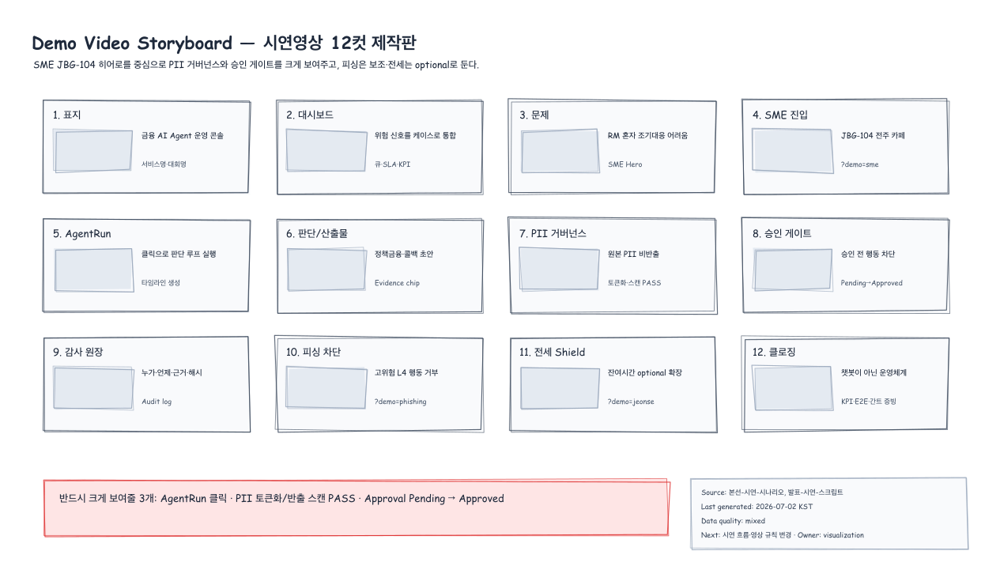
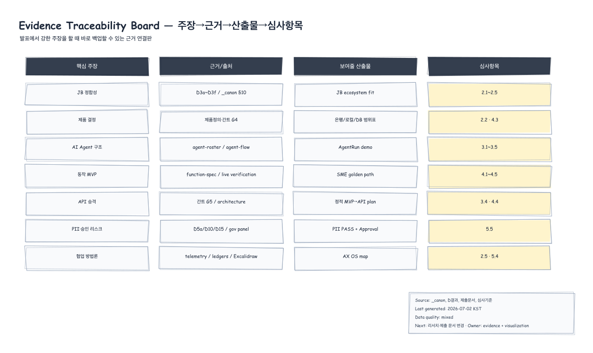
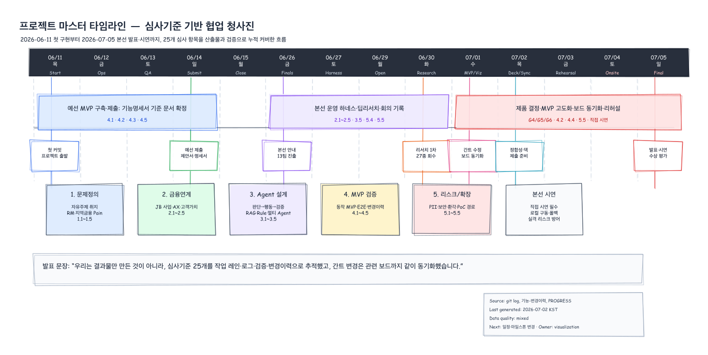
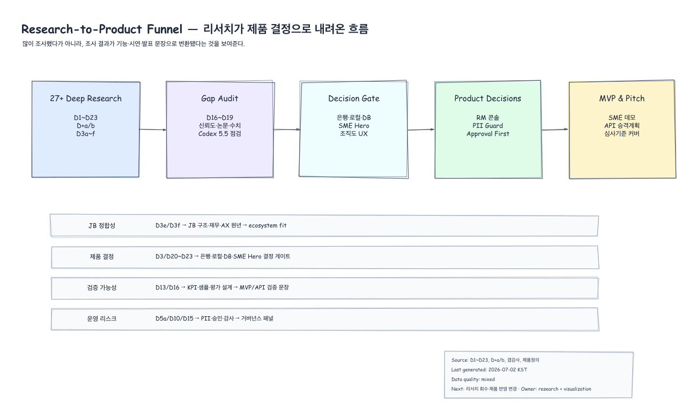
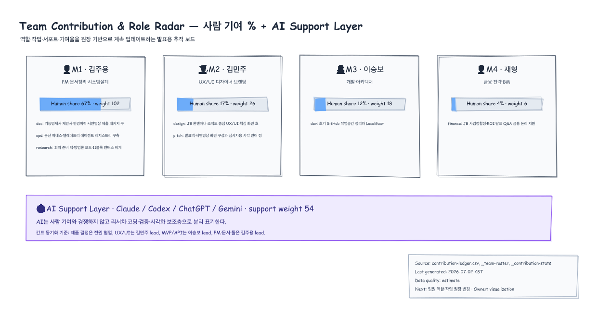
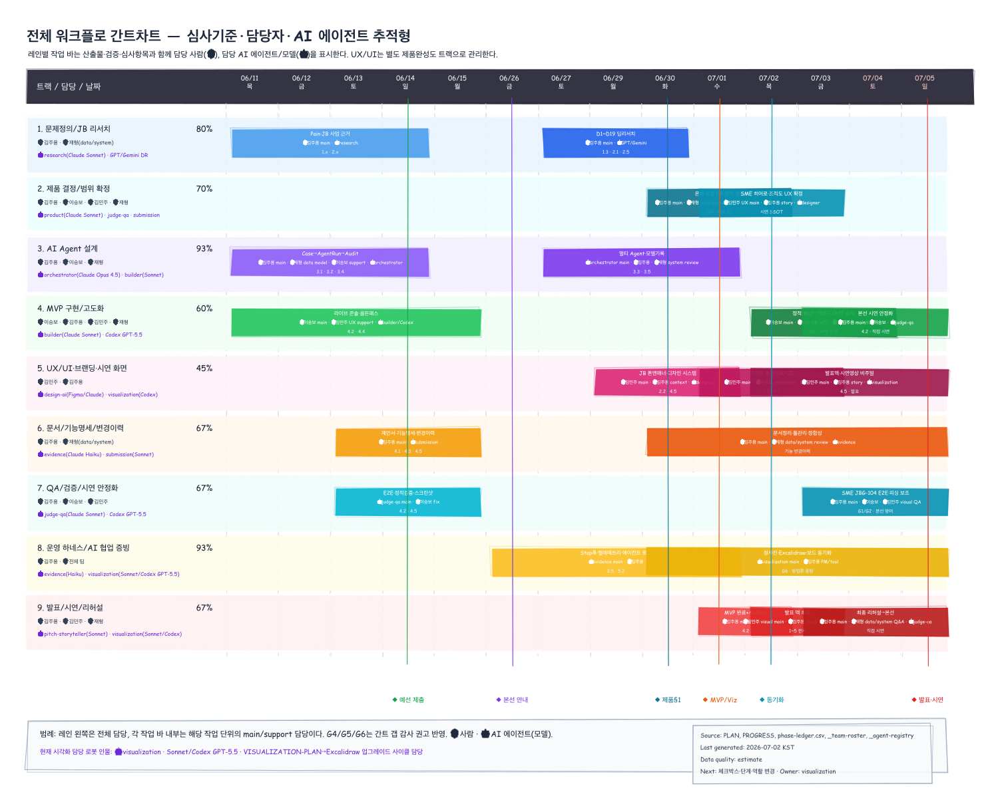

---
tags:
  - area/assets
  - type/index
  - status/active
date: 2026-07-02
up: "[[08_본선/_system/visualizations/_viz-index|시각화 인덱스]]"
---

# Excalidraw Exported Images

Generated: 2026-07-02 KST
Export style: hand-drawn

GitHub preview page for the shared hand-drawn Excalidraw exports.

## Recommended Sharing Order

1. `project-master-timeline.png` — 전체 일정
2. `workflow-gantt-blueprint.png` — 간트·역할·AI 협업
3. `team-contribution-role-radar.png` — 팀원/AI 기여 구조
4. `research-to-product-funnel.png` — 리서치→제품결정 흐름
5. `evidence-traceability-board.png` — 주장→근거→제출물
6. `demo-video-storyboard.png` — 시연영상 구성

## Share Picks

### demo-video-storyboard

### evidence-traceability-board

### project-master-timeline

### research-to-product-funnel

### team-contribution-role-radar

### workflow-gantt-blueprint

## Full Export List

| PNG | SVG |
|---|---|
| [agent-flow.png](agent-flow.png) | [agent-flow.svg](agent-flow.svg) |
| [ax-operating-system-map.png](ax-operating-system-map.png) | [ax-operating-system-map.svg](ax-operating-system-map.svg) |
| [contribution.png](contribution.png) | [contribution.svg](contribution.svg) |
| [demo-golden-path-state-machine.png](demo-golden-path-state-machine.png) | [demo-golden-path-state-machine.svg](demo-golden-path-state-machine.svg) |
| [demo-video-storyboard.png](demo-video-storyboard.png) | [demo-video-storyboard.svg](demo-video-storyboard.svg) |
| [evidence-traceability-board.png](evidence-traceability-board.png) | [evidence-traceability-board.svg](evidence-traceability-board.svg) |
| [finals-demo-readiness-map.png](finals-demo-readiness-map.png) | [finals-demo-readiness-map.svg](finals-demo-readiness-map.svg) |
| [jb-ecosystem-fit.png](jb-ecosystem-fit.png) | [jb-ecosystem-fit.svg](jb-ecosystem-fit.svg) |
| [jb-finance-snapshot.png](jb-finance-snapshot.png) | [jb-finance-snapshot.svg](jb-finance-snapshot.svg) |
| [jb-group-structure.png](jb-group-structure.png) | [jb-group-structure.svg](jb-group-structure.svg) |
| [jb-history-timeline.png](jb-history-timeline.png) | [jb-history-timeline.svg](jb-history-timeline.svg) |
| [judge-criteria-coverage-map.png](judge-criteria-coverage-map.png) | [judge-criteria-coverage-map.svg](judge-criteria-coverage-map.svg) |
| [project-master-timeline.png](project-master-timeline.png) | [project-master-timeline.svg](project-master-timeline.svg) |
| [research-to-product-funnel.png](research-to-product-funnel.png) | [research-to-product-funnel.svg](research-to-product-funnel.svg) |
| [team-contribution-role-radar.png](team-contribution-role-radar.png) | [team-contribution-role-radar.svg](team-contribution-role-radar.svg) |
| [timeline.png](timeline.png) | [timeline.svg](timeline.svg) |
| [tokens-time.png](tokens-time.png) | [tokens-time.svg](tokens-time.svg) |
| [update-control-tower.png](update-control-tower.png) | [update-control-tower.svg](update-control-tower.svg) |
| [urgent-action-map.png](urgent-action-map.png) | [urgent-action-map.svg](urgent-action-map.svg) |
| [workflow-gantt-blueprint.png](workflow-gantt-blueprint.png) | [workflow-gantt-blueprint.svg](workflow-gantt-blueprint.svg) |

