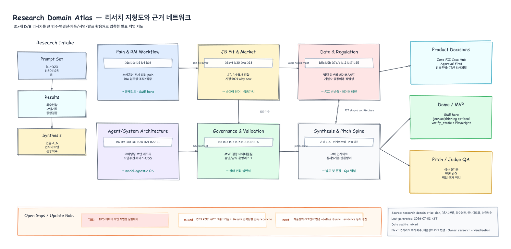

---
tags:
  - area/assets
  - type/index
  - status/active
date: 2026-07-02
up: "[[08_본선/_system/visualizations/_viz-index|시각화 인덱스]]"
---

# Excalidraw Exported Images

- Generated: 2026-07-02 KST
- Export style: hand-drawn
- Source: `08_본선/_system/visualizations/*.excalidraw`
- Output: `08_본선/assets/excalidraw/exported-images/20260702/`

## 공유 우선 후보

| 우선 | 이미지 | 원본 | 용도 |
|---|---|---|---|
| ✅ |  | `../../../../_system/visualizations/demo-video-storyboard.excalidraw` | 시연영상 구성 논의 |
| ✅ |  | `../../../../_system/visualizations/evidence-traceability-board.excalidraw` | 주장→근거→제출물 추적 |
| ✅ |  | `../../../../_system/visualizations/project-master-timeline.excalidraw` | 프로젝트 전체 일정 공유 |
| ✅ |  | `../../../../_system/visualizations/research-domain-atlas.excalidraw` | 리서치 범주·연결 지도 |
| ✅ |  | `../../../../_system/visualizations/research-to-product-funnel.excalidraw` | 리서치→제품결정 흐름 |
| ✅ |  | `../../../../_system/visualizations/team-contribution-role-radar.excalidraw` | 팀원/AI 기여 설명 |
| ✅ |  | `../../../../_system/visualizations/workflow-gantt-blueprint.excalidraw` | 팀 운영·간트·역할 보고 |

## 전체 Export

| PNG | SVG | 원본 |
|---|---|---|
| [agent-flow.png](agent-flow.png) | [agent-flow.svg](agent-flow.svg) | `08_본선/_system/visualizations/agent-flow.excalidraw` |
| [ax-operating-system-map.png](ax-operating-system-map.png) | [ax-operating-system-map.svg](ax-operating-system-map.svg) | `08_본선/_system/visualizations/ax-operating-system-map.excalidraw` |
| [contribution.png](contribution.png) | [contribution.svg](contribution.svg) | `08_본선/_system/visualizations/contribution.excalidraw` |
| [demo-golden-path-state-machine.png](demo-golden-path-state-machine.png) | [demo-golden-path-state-machine.svg](demo-golden-path-state-machine.svg) | `08_본선/_system/visualizations/demo-golden-path-state-machine.excalidraw` |
| [demo-video-storyboard.png](demo-video-storyboard.png) | [demo-video-storyboard.svg](demo-video-storyboard.svg) | `08_본선/_system/visualizations/demo-video-storyboard.excalidraw` |
| [evidence-traceability-board.png](evidence-traceability-board.png) | [evidence-traceability-board.svg](evidence-traceability-board.svg) | `08_본선/_system/visualizations/evidence-traceability-board.excalidraw` |
| [finals-demo-readiness-map.png](finals-demo-readiness-map.png) | [finals-demo-readiness-map.svg](finals-demo-readiness-map.svg) | `08_본선/_system/visualizations/finals-demo-readiness-map.excalidraw` |
| [jb-ecosystem-fit.png](jb-ecosystem-fit.png) | [jb-ecosystem-fit.svg](jb-ecosystem-fit.svg) | `08_본선/_system/visualizations/jb-ecosystem-fit.excalidraw` |
| [jb-finance-snapshot.png](jb-finance-snapshot.png) | [jb-finance-snapshot.svg](jb-finance-snapshot.svg) | `08_본선/_system/visualizations/jb-finance-snapshot.excalidraw` |
| [jb-group-structure.png](jb-group-structure.png) | [jb-group-structure.svg](jb-group-structure.svg) | `08_본선/_system/visualizations/jb-group-structure.excalidraw` |
| [jb-history-timeline.png](jb-history-timeline.png) | [jb-history-timeline.svg](jb-history-timeline.svg) | `08_본선/_system/visualizations/jb-history-timeline.excalidraw` |
| [judge-criteria-coverage-map.png](judge-criteria-coverage-map.png) | [judge-criteria-coverage-map.svg](judge-criteria-coverage-map.svg) | `08_본선/_system/visualizations/judge-criteria-coverage-map.excalidraw` |
| [project-master-timeline.png](project-master-timeline.png) | [project-master-timeline.svg](project-master-timeline.svg) | `08_본선/_system/visualizations/project-master-timeline.excalidraw` |
| [research-domain-atlas.png](research-domain-atlas.png) | [research-domain-atlas.svg](research-domain-atlas.svg) | `08_본선/_system/visualizations/research-domain-atlas.excalidraw` |
| [research-to-product-funnel.png](research-to-product-funnel.png) | [research-to-product-funnel.svg](research-to-product-funnel.svg) | `08_본선/_system/visualizations/research-to-product-funnel.excalidraw` |
| [team-contribution-role-radar.png](team-contribution-role-radar.png) | [team-contribution-role-radar.svg](team-contribution-role-radar.svg) | `08_본선/_system/visualizations/team-contribution-role-radar.excalidraw` |
| [timeline.png](timeline.png) | [timeline.svg](timeline.svg) | `08_본선/_system/visualizations/timeline.excalidraw` |
| [tokens-time.png](tokens-time.png) | [tokens-time.svg](tokens-time.svg) | `08_본선/_system/visualizations/tokens-time.excalidraw` |
| [update-control-tower.png](update-control-tower.png) | [update-control-tower.svg](update-control-tower.svg) | `08_본선/_system/visualizations/update-control-tower.excalidraw` |
| [urgent-action-map.png](urgent-action-map.png) | [urgent-action-map.svg](urgent-action-map.svg) | `08_본선/_system/visualizations/urgent-action-map.excalidraw` |
| [workflow-gantt-blueprint.png](workflow-gantt-blueprint.png) | [workflow-gantt-blueprint.svg](workflow-gantt-blueprint.svg) | `08_본선/_system/visualizations/workflow-gantt-blueprint.excalidraw` |

